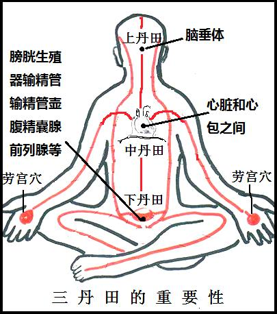
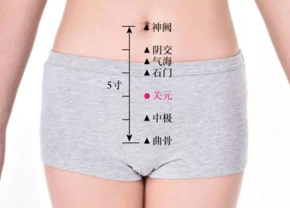
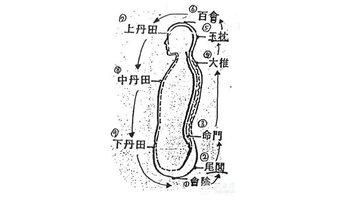

一，多走动，多走动既可以增强身心健康，也可以提高见闻，正所谓读万卷书，行万里路。

二，多实践，多做题，多提出为什么，多做实验。

三，多总结，多写笔记，多写心得，多写论文，多写开源书籍。

四，多共享，多答疑解惑，多以灵活的离散的随机的讲故事的反问的启发的方式教书育人，而非死板的连续的递进的纯理论的陈述的填鸭的方式教学。

## 基本概念

### 穴位

中医的穴位不是某一个点，而是一个范围，即中医所说的”离穴不离经”，穴位定位不一定要追究那个小的点。 

### 寸长

每个人的高低、胖瘦、骨节的长短都不一样，所以穴位的远近距离也不相同，因此要以本人的“同身寸”为准。 

三寸并不是一个常量10厘米，而是因人而异，一般为整个中指的长度，中指的每一指节为一寸，三节正好为三寸。

### 横指

一横指，指中医同身寸中的一寸在针灸上“一寸”是指的“同身寸”。

### 测量定穴的方法叫手指同身寸法，常用有一下三种

-  中指同身寸：是以中指中节屈出时内侧两端纹头之间作为1寸，用于四肢部取穴的直寸和背部取穴的横寸。 
-  拇指同身寸：是以拇指指关节的横度作为1寸，适应于四肢部的直寸取穴。 
-  横指同身寸：又名`一夫法`，是将食指、中指、无名指和小指并拢，以中指中节横纹处为准，四指横量作为3寸。 

### 丹田

丹田的概念原是道教内丹派修炼精气神的术语，现在已被各派气功广为引用。《东医宝鉴》引《仙经》之文，不仅指出丹田的所在，而且还阐述了丹田的功能：

> 脑为髓海，上丹田；心为绛火，中丹田；脐下三寸为下丹田。下丹田，藏精之府也；中丹田，藏气之府也；上丹田，藏神之府也。

古人称精气神为三宝，视丹田为贮藏精气神的所在，因此很重视丹田的意义，把它看作是“性命之根本”。 

## 测量定穴

### 关元穴

在脐下三寸即为关元穴。

### 气海穴

在脐下两寸即为关元穴。

### 三丹田

  

### 上丹田

为百会所在，亦即泥丸宫、升阳府、昆仑顶、灵台等，道家所指名称甚多，可以说是各自命名，众说纷纭，不过多指脑而言。其中玄关所指在两目两眉与额、鼻骨之十字中心处，道家对此也十分重视，认为是入道之门，或泛指气功基础，认为是天地灵根，是祖窍、祖气，至宝至贵。 

上丹田在督脉的循行路上，属于阳性，是阳气集中的地方，是藏神之所，是主管意识活动的神经中枢所在。是练功入静的主要部位。上丹田的作用是锻炼神经系统，控制自己的意识活动，调节、增强神经中枢，抑制整体代谢机能，从而发挥贮能性效应。这有助于休养生息，积聚精力与疾病作斗争，获得健康。所以，练功后感到体力增强，精力充沛，是有道理的。 

上丹田在头部，头部为诸阳之会，凡气虚下陷，头部怕风寒，以及脑贫血、低血压病人，可意守上丹田，但初学气功者，不要马上意守上丹田，以免气机上窜引起头晕；阳盛的病人（如心火上炎、肝阳上亢、高血压）也不要意守上丹田。 

### 中丹田

中丹田：为膻中所在，为自承浆下十二层楼（指喉管）至黄庭（指人体内中虚空窍，或在心之下……），以牛郎代表心为阳，有肝胆脾均各自专职，共同耕种心田，故有“我家专种自家田，可育灵苗活万年……灌溉须凭上谷泉（指舌顶上颚，所谓白头老子眉垂地之律液至上鹊桥），有朝一日功行满，便是蓬莱大罗仙。”

中丹田在胸部，如病人是中气下陷，妇女月经过多，可意守中丹田，但容易引起胸闷，要慎重使用。

### 下丹田

下丹田：即正丹田，在脐下，或有称之为气海，藏命之所，以织女代表肾为阴性。

按道家以织女喻肾，为真阴，在卦为坎；以牛郎喻心，为真阳，在卦为离，阴阳合则为真夫妻，阴阳合则生丹药，所以还有坎离交媾，男女媾精阴阳合而生丹药之喻。心肾交，水火交，龙虎交之类等等，也都是指练功中之术语。图中“水火交炼池”即喻心肾相交之处所。

下丹田，是练功诱导得气的主要部位，其作用是锻炼体液系统，激发体内的能量物质，以调节、充实体液循环，提高整体代谢机能，从而发挥激能性效应。这对人体充实下元，防止早衰，健身延年起重要作用。

## 提肛收腹和腹部按摩

> 常年坚持这套动作，每天2次左右，可以使人神完气足，身体更加健康。

### 预备

姿势：站式、坐式、卧式均可。

动作：全身放松，意守丹田，两手置于膝盖上或大腿外侧，手心朝上。

### 提肛收腹

吸气：心中默念“收---”，两拳、两阴（肛门和尿道）、以及小腹逐步紧收。

呼气：心中默念“放---”，两拳、两阴、小腹逐步松放。

时长：80-100次。

### 腹部按摩

姿势：两掌重叠，置于腹前。

逆时针圆周发散按摩36下，顺时针圆周收敛按摩36下。

## 意守下丹田 

意守是练功人将意念集中和保持在自身某一部位或某一事物上以帮助意识进入气功入静状态，并在此基础上发挥意识能动性，主动感知和调整自身功能活动，来达到良好效果的练功方法与过程。意守丹田，是练功人将意念集中并保持在丹田部位的练功方法，是众多意守方法中的一种。更确切地讲，这种方法属于意守自身部位类中的意守穴位法。但实际练功时，人们是无法将意念仅仅守在一个穴位上，只能意守在以穴位为中心的一个范围内。因此，将丹田理解为这样一个范围更合适些。 

人身虽有三丹田、五丹田之说，但实际练功时，除特殊情况之外，一般所说意守丹田，都是指意守下丹田。古人认为下丹田和人体生命活动的关系最为密切。是“性命之祖”、“生气之源”、“五脏六腑之本”、“十二经之根”、“阴阳之会”、“呼吸之门”、“水火交会之乡”，是真气升降开合的枢纽，是汇集烹炼、储存真气的重要部位。 

### 下丹田位置

- 版本一： 道家指人体脐下三寸的地方。
- 版本二：关元、阴交、气海、石门四个穴位位于腹部脐下，都叫做丹田。 

  

### 预备姿势

行住坐卧皆可，两眼自然微闭，意向顺着鼻尖，内视下丹田。

### 动作

意守下丹田，直至外动如四肢或身体某些部位或下丹田有微热感或电流感。

### 呼吸

  

吸气时，提肛，气循督脉上百会。

呼气时，松肛，气循任脉下丹田。

### 时长

半小时至一小时

### 收功

两掌轻压下丹田位置，心中默念：“收功---，收功---，...”。

### 说明

- 自然而然舌顶上腭，不必硬顶。

- 有些人意守下丹田时感觉不明显，但却觉得“命门穴”附近发热，这也是将要通“小周天”的现象。你可以轻轻意守“命门穴”，气走时意念就跟着它走；气停的时候意念就跟着它停。这叫“意气相随”，千万不要去导引它。收功时，轻轻意守“下丹田”，但不要有意将气引回来。

- 意守下丹田时，有些人会看到火球、玻璃珠、旋涡，或者动物、植物等。随其自生自灭，不要执着和追求，也不必害怕。这是正常的现象。