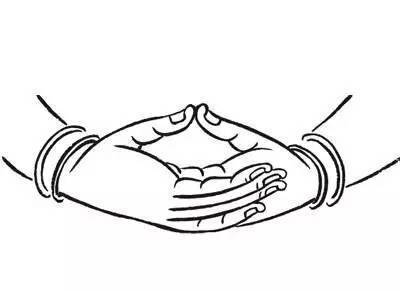

# 静坐

> 此文非原创，欢饮转载，普利众生。

[toc]

## 南怀瑾大师说姿势七要点

> 南禅七日

- 两脚双盘坐，其学名称跏趺坐。右脚在上称金刚降魔坐，左脚在上称如意吉祥坐。初学者可循序渐进，先从单盘开始做起。
- 背脊骨挺直，七支坐，先天一炁，虚无中来。
- 两肩拉平，既不挺胸也不拔背，既不前倾也不后仰。
- 双手放置于，腹前一拳有余，脐上一寸五分，结禅定印或掐子午诀均可。
  - 定印，左手在下，右手在上，两拇对顶。如下图所示，
  
      
  
  - 太极阴阳八卦连环诀，左手大拇指经左手虎口按捏右手无名指指根（子诀），右手拇指捏定右手中指（午诀），故称子午诀，左手为善在外，右手为恶于内，为负阴抱阳。
- 仰首。
- 舌抵上腭。
- 面有双恶鸟，胸有三毒蛇。双目垂簾，可看三步，视而不见，听而不闻。初学者或眼睛疲劳者可双眼全闭。

> 守心不守窍。

## 六祖坛经摘

何期自性，本不生灭，本自清净，本自具足，能生万法，本无动摇。

## 打坐的神奇

金字塔的神奇请自行谷歌。

从外看金字塔是神奇的，向内找，人的身体比金字塔不知要神奇多少倍。人在打坐的时候，往往要求人盘腿而坐，双腿叠加，双手放在膝盖上，叫五心（手心、脚心、百会）朝天。这时，人体打坐的形状，就形成了一个典型的金字塔形状，就能采集到天体中高层空间的能量，得到天人合一的状态。长期的打坐下去，人的身体就会健康；人的思想就会宁静；人的头脑就会清醒，还能开发人的智慧，激发人的功能。眼能看到奇景，鼻能嗅到异香；耳能听到妙音；舌能尝到甘味，身体感到轻松、有漂在空中的感觉；意识通灵，清醒的意识到另外空间的存在，眼耳鼻舌身意同时感受到身临仙境的妙不可言的状态。

## 大小周天

小周天（胸到后背）之所以重要，是因为，人体所有重要的内脏器官都在这条线上，重回健康态，一定要打通任督二脉。大周天只是在这基础上补上四肢而已，所以，小周是修复物质身体的基础，也是所有修行中的重中之重。 

## 从道家的角度上讲

人在盘腿打坐的时候，头顶着天，接收着宇宙天体的高能量，叫开天门；会阴被坐在底下，避免能量从会阴逃出，叫闭地户；双手心、双脚心加上头顶朝上，采集吸收天体中的高能量，叫五心朝天；双腿相叠，使脚三阴、脚三阳相交，得到双腿能量的互补；双手结印，使手三阴、手三阳相接，得到双手能量的灌通；舌顶上颚，牙齿微微离缝，嘴唇闭上，使任督二脉相连，得到身体大脉的畅通，叫搭鹊桥。

## 从修行者的角度上看

舌头顶住上颚，嘴唇闭上，任督二脉相通，形成一个周天循环，就是我们常说的周天。一般情况下，子时、午时，人体在放松、睡眠休息的时候，才能形成周天循环，所以，养生的人注重睡子午觉，所以，把这种周天循环叫做子午周天；而修炼是人为的把两脉相接，让身体上的脉得到更大程度的畅通，保持身体的健康和精神的充沛。

双腿相叠，双腿就形成了一个三角形周天，形成一个脉络循环；双手结印，两手与头之间，也形成了一个相似的三角形周天，又形成一个脉络循环；十二正经相互连贯，就形成了人体侧面的一种循环形式。按照身体自然的循环时辰划分，这种循环，一般在卯时和酉时运转，人体自动形成循环运行，所以把这种修行方法叫做卯酉周天。

人在打坐入静、入定的情况下，身体内的五脏会和谐相生，协调相克。通过肾水往上行，心火往下降，叫水火相济，通过肝气往西行，肺液往东运，实现金木相交等等；形成人体内的一种周天循环；得到五脏五腑的相生运转、相克运行和三焦的相互贯通，形成人体内的一种周天循环，使人身体的潜能达到最大限度的发挥。

## 修行

修行到一定程度，养生到一定阶段，你会发现，如果不放弃自己不好的思想、不真的行为、不善的举动、不良的习惯，你就不能把自己的业转化为德；没有明师去指导，你的心性得不到提高，你的德也转化不成功，就很难再有新的修行突破和养生进步。  

放下人的各种不好的想法，像金字塔那样，不去思、不去想，静静地坐在那里，带着无所求的目的去修行的时候，你就符合了道家的“道”、佛家的“法”。你的先天父母就会帮助你，让你得到你应该得到的美好的东西；你所尊崇的师尊就会把修行的种子给你，让你在信心中生根、坚持中开花、考验中结果，直到走向圆满，修成正果。

## 极简打坐入门法教学

#### 一，时间地点方位

就算是在办公室午休时，随便找一张软硬适中的凳子，最好没扶手那种。人靠前一些，不必盘腿，用正常的坐姿坐下来，只坐三分之一的位置（臀部压在凳子上太多的话，肌肉难以放松，气流不能流动）。然后，轻轻拉直腰板，尽量保持脊椎垂直，能量在脊椎中直线传导当然最快。线条千万不要太硬，这不是军训，不要摆pose，只需自然地垂直，太僵硬的话，肌肉就会紧绷，气流不能流动。 

手势是这样的，男子左手四指握右手四指，左手大拇指抵着右手虎口，女子是右手四指握左手四指，右手大拇指抵着左手虎口。【此处，佛医堂建议大家手势结定印】然后轻轻松松地放在小腹前，这样双手一握上，头、肩、双手，就形成一个能量的回路。 

好，现在我们，把肩膀放轻松，全身肌肉处于松驰状态（松驰是又松又直不是松垮），不停地调整自己让身体保持一个平衡点，尽量做到让全身没有一块肌肉在用力，同时，脑袋里保持什么也不想的状态，一分钟。

对，只要一分钟的空念，什么也不想，这谁都做得到。……松、直、空，保持一分钟后，我们就会发现，双手变得很热。这就是传说中的宇宙能量。能量经由头、肩、手臂到你的双手，这条线路是全身最通畅的线路，因为双手天天在动啊，基本没什么经络会堵塞。而这条能量传递线路的底部，能量蓄水池的底部就是我们的双手，所以，手是全身最快就会热的部位，原理就这么简单。

如果有的朋友双手热不了，就得对照前文找找原因，是不是太紧张，没有放松肌肉？继续不停地调整姿势，找到最佳角度。一分钟之内，手不热，姿势一定是错的。

 我以这个方法试过许多人，没有一个做不到的。掌握了这种状态，就是日后我们在打坐中要保持的放松态，而吸引能量入体，没什么稀奇，谁都做得到，刚入门时以这种方法来调试状态，可以少走很多弯路，立竿见影的能量感到手上，也可以增加每个有意修行的朋友们的信心。打坐——原本就是这么简单。

#### 二， 找到感觉后， 我们可以开始日常的练习

现在可以坐着，有条件就盘腿，不盘也没关系，放松舒适为主，如果站着，双手就自然垂下在身子两侧。随时保持好心情，平和安宁，可以听轻音乐，想象能量——光，从头顶至下，如水般浇透全身。如果有朋友说想象力不够，这样吧，我们直观点，想不到头顶有能量下来的，可以拉一盏100W白炽灯在头顶，这样就可以感觉到有光又有热啦。若是能量下来得少，好，我们用双手指尖用力梳一下头部，头皮一松，能量就好下来。

至于打坐初期头脑中不停地会产生念头，是相当正常的反应。不必太过在意。科学家特斯拉冥想，佛佗在树下证悟，我想他们都没有想过什么光与爱之类的，特斯拉一定心里装着他的电机图，佛佗当然不用念佛经（笑），他用不着崇拜自己，他是带着很多生活中解决不了的哲学问题来思考的，最后这两人都有大成果，所以，有念头不要紧，重要的是念头的纯净度。

是杂念还是净念？只要思想纯净，想数学题，听音乐，我觉得都没什么大问题。反正，我打坐时从没断过想法，有时想让自己开心的事，有时反思自己的行为，当然有时也想着头上有个大太阳，光照全身，包裹所有细胞什么的。搞怪点的，就玩花样，紫火净化啦，光之金字塔啦，早期都玩过，但不是太经常，比较喜欢自然的想法，太刻意的就是意念重了。后来，能量流大了，身上气感强，自然就不会分心，而一心跟随身体的各种反应去了。

总之掌握以下原则：松——直——静（净）——舒适。肌肉一定要放松，背部尽量垂直，累了可以找个靠垫，心思安静或纯净，身体一定要舒适。站桩、平坐、侧卧、单盘都是可以的。有人一闭眼就头晕，那就取香功的桥段，半眯着眼，让微光透进眼睑。双盘当然是最好的，因为双盘时人体形成一个能量的金字塔，功率放大器。

但如果腰椎有病，坐着不行就站着，站累了，就侧卧。平时出门在外，端坐在凳子上也可以放松。在打坐过程中可以不停变换姿势，怎么舒服怎么来。呼吸什么的，真的不要讲究。如果打坐人不舒服，很难坚持得下来。

另外还有个原则——“松而不懈”。心态很放松，但练习并没有三天两天就晒网。只随手捡些松散时间。二十分钟、半小时均可，被人打断不要紧，也不用挑地方，在银行排队时，车站等车时，无一处不可静心，让静心成为生活的一种状态，而不是功能态。

## 定心绝虑

静坐之难，在于静心。人生于世，从有自我意识开始，就几乎无时无刻不在思虑。不停思虑的大脑即使在人入睡之后，也仍然在积极活动，正可谓树欲静而风不止。身体想要休息，大脑中的意识部分仍象上了发条似的自己转个不停。这个不停在转的意识部分是人多求多欲的理性的产物。它与人的精神当中的更深层次的部分存在某种背离。这种更深层次的部分是由人的自性决定的。很有可能正是这种背离导致了梦的出现。真正身心合一的人是不太做梦的。《庄子•大宗师》就讲“古之真人，其寝不梦，其觉无忧。”我自己从开始静坐以来，也很少做梦，睡眠时间虽然不是很长，常常五六点钟即醒，但基本上没有休息不足的感觉。以前在南京教书期间，在情感和事业上都有太多让自己不安心的方面，睡觉就相当成问题，经常做恶梦，以及早醒。

心不静，人就不可能客观冷静地观察、思考和判断，更无从一步步深入了解自己的本性以及放下种种妄自造作的执着，并最终使自己在心性和精神修为上脱胎换骨。这也是儒释道三家都把静作为最为根本的修炼法门的原因。

为了让多思多虑的人有个方便的入静法门，有一些小技巧，比如数息法。但是，我发现呼吸与人的精神状态之间有种奇妙的关联，那就是呼吸越慢，人的精神状态越平静，而且这种关联是可以人为调节的。生活中的一个常识是人在紧张的时候，比如考试之时，通过深呼吸，可以让精神略为缓和。这个法门是可以用到静坐上来的。静坐的根本是静心，即无思无虑，无欲无求。一个成年人一开始谁也做不到长时间地无思无虑。我自己已经静坐了将近一千个小时，已经开始体会入静较深的感觉，但思想上也时时会开些小差。所以一开始做不到心无杂念是没有太大关系的。就象一个学打乒乓球的人，一开始打不好是没有关系的，关键是要持之以恒，循序渐进，总会越打越好。在开始静坐的时候，在自然呼吸的基础上，可以试着把呼气略为放慢一点。只管呼气，不管吸气，因为在一个呼气之后，肺部的气压小于外界的气压，吸气是不费力的事情，而呼气则要稍费点力。把将呼气的过程略为变慢，是需要一点儿意念的工夫的。因此，只要有意识地将呼气变慢一点儿，思想就无暇开小差了。就我自己的经验而言，每次感觉到自己的呼吸变成了一个自动的，不假思索的过程，就知道自己思想开小差了，赶紧将意念收回来，重新将呼气变成一个在一定程度上受到操控的过程，就能重新找到入静的感觉。 

 当然，静坐绝非寂然枯坐，象西西弗斯一样与自己的心猿意马做无休无止的苦苦斗争的过程。那样的静坐只会让人对静坐产生无意义甚至绝望之感。静坐的奇妙之处，正在于通过静坐，人能真正体会到道家所说的“动极生静，静极生动”，以及《黄帝内经》中提到的“恬淡虚无，真气从之。”气这个东西，虽然至今还不能对它从科学上进行充分的解释。但有一点是毫无疑问的。它在人于思维和情绪都处于活跃状态时处于蜇伏状态，而在人有意使自己处于无思无虑状态的过程中开始苏醒与活跃起来。在我们静心去摒弃杂念的过程中，我们的身体就会一点点地出现变化，比如不同部位出现沉重、发热、发烫、发凉、发麻等感觉。这都是气的作用。我们还能感觉到气有规律地沿着一定的路线在身体里运转。气的活跃引发身体的反应和变化是一个好的现象。对待这种反应既不应有意去追求，也不应加以忽略。有意追求偏离了无思无虑，无欲无求的大原则，加以忽略则使我们不能将意念单纯地落到自己的身体上，不能体会一步步进入深层入静的状态。一旦到了深层入静，无物无我，天人合一的状态，人就能无需一切人为的努力，自然而然地做到无思无虑，无欲无求。只是这是一个需要经过几百上千个小时的训练，视个人的身体和心理状态需要经过不同程度的折磨和坚持才能达到的状态。而到了这个状态，人的心性甚至人的生理状态已经开始发生很大的变化，能够更好地控制自己的情绪，更冷静和平衡地应对各种情境，对人生中的种种境遇，甚至生和死都持淡然处之，尽管不是无所谓的态度。也只有在这种状态下，人的创造力和潜力才有可能得到最大程度的发挥。

在我看来，真气运行法至少做为一种入门级的训练方法还是有它的优势的，这主要是因为它突出并且精练地指出了静坐与气的关系，以及气的运转规律。在体会到气的运转及相应的身体反应之后，入静就会比较容易。而儒家和佛家，包括在西方很流行的源于缅甸的内观（vipassana）虽然强调静，但似乎都没有很好地总结静坐与气的关系，甚至压根儿没有提到气，没有把它理论化。这就使刚开始静坐的人只紧紧盯着无思无虑这一条，而忽略了身体上气机初起时的感受。这些通常都比较让人舒服的感受一旦被忽略，人就容易东想西想，结果气机的运行就受到了压抑。而在气的运行不旺盛的情况下，静坐很容易引起腰酸屁股疼。我的一些外国朋友，包括学习之路的发起人Joya，都曾经参加过为期一个星期甚至十天的内观训练。但问她们有何感受，却是仍然茫然不知静坐有什么意义，也至今也没有使静坐成为自己日常生活的一部分。在这种情况下，静坐始终不过是一件充满煎熬和挣扎的苦役，就象人生本身。

静坐显然也不仅仅是一种锻炼身体，使人防病强身的技巧。如果仅仅是为了防病强身，甚至为了追求什么武功或特异功能去静坐以练气，固然在一开始可能会有些许成效，但我以为迟早会遇到瓶颈，甚至进入邪途。只有对于人生充满疑问，对于自己和他人的精神成长始终不能忘怀，对于最终的“道”有着无法放弃的追求，对人世间的苦难有深刻的悲悯的人，才因其能够不断地跳出小我的局限与束缚，不斤斤于一己的利害得失，而始终能够从静心养气中日复一日地获得滋养与支撑。《孟子•公孙丑（上）》里提到，“夫志，气之帅也。”志和气之间，实在有着不可分割的联系。我们汉语里常用的“志气”一词，实在是有古人的深厚智慧在里面。 

## 静坐的阶段

#### 一，入静

开始练习静坐，身心放松，大脑松开，就会出现一瞬间的大脑融化的感觉。开始只能体验几秒。但是，这个感觉非常舒服。大脑没有负担，如同融化一样的轻松。关键在于松脑。很多学者都在盯目标，观幻想，变的越来越紧，虽然会注意力集中大脑清醒，但是后遗症是紧的容易纠缠。所以，第一步是全面放松。紧的话，就无法体验清凉舒服。

#### 二，身体不累

入静的感觉开始静坐维持不了多久。总共能坚持几分钟，那么，偶尔才能有入静的体验，每次也只是几秒。但是，这个几秒的感觉会让人喜欢上静坐。随着每天早晚练习的持续，腿疼，身体到处难受的情况有所适应。会出现身体自动调整，不用力，也能自然直的状态。坐十几分钟也不觉得累。起坐才发现腿麻。

经历前两个阶段，需要一段时间的练习。快的几周，慢的半年。入静也会随着练习增加，从开始的几秒，会越来越长。一分钟。几分钟。身体不累，一般能做20分钟，就会有很多想法爆发，大脑里开始冒出各种想法，无法继续静下去。这个时候起坐即可。在前期的练习期间，入静会有几分钟之久。这就说明身体变的协调，想法也开始减少了。

在这个阶段里，日常生活中能明显的感觉到意识变的更清醒。注意力集中了很多。情绪变的淡化，心柔软了很多。等等无法想象的身心变化。如果没有入静体验，没有大脑松下来的舒服感觉，就无法对静坐产生好感。就无法持续。如果身体没有持身法出现，久坐不累，也会中途放弃。因为，没有身心受用出现，那就是方法上不对。需要立刻调整。

#### 三，梦境出现

随着练习，15分钟都能很轻松的坐着。还能很容易达到入静，也很频繁的能重现出来入静。这是身心达到了一种最初步的统一。接着，就会碰到一个问题。梦境的出现。开始静坐，入静，身体自然伸直。而下一秒，就会出现梦。明明知道自己坐着，梦就那么的突然出现。而且是在静坐的时候出现。还是坐下来处于精神饱满的状态时。这个时候不要怕，也不要认为有问题。这就是一个关卡。梦出现时，要尽可能让自己在梦境出现的瞬间就摆脱梦境。开始非常难。很容易就迷惑进去。在摆脱梦境的过程中，就会对梦与清醒有一个认识。这个过程很费劲。但是，日常中的清醒会越来越明显。迷糊的中间过程会消失。比如，起床的那一刻，会朦胧。而现在，基本醒来就会非常清晰，没有朦胧的过程。有人因为怕被打扰，怕梦境停止练习。这就如同一朝被蛇咬的情况。只有继续才有下一步的体验。

#### 四，清凉遍及全身**。（**纠结的斩断过程）

前三个阶段是基础部分。通过了，就会对静坐有信心。随着日常越来越清晰，身心协调，心会变宽。然而，这里开始就要面对我们自古以来的根源-----【我】的触动。

通过入静的松脑，适应的持身法不累，梦境的对抗中清醒，基础会越来越牢固。同时，对外界的干扰处理的差不多。比如，想法减少，身体不舒服越来越少，迷糊的情况减少。

同时，随着大脑松弛，全身协调，开始出现从头顶遍及全身的清凉感觉。刚开始，只要松脑就会在头顶有指甲盖大小的清凉，之后，随着练习越来越扩大。从头部，到胳膊，腿。到身体。全面清凉。需要出现清凉时，引导清凉的感觉蔓延到全身。如同包裹整个身体一样。凉凉的。

那么，清凉的同时，还需要注意一个问题。在清醒回归下，会出现一个最直接的问题。我们的痛苦源头会显现出来。那个最根本的痛处。以前被无数的诱惑所掩盖，现在干扰去除了，要直接面对痛的源头了。就这么直接。

什么是最根本的痛？别人掐你，会愤怒。自己掐自己不会。同样是掐，为什么不同反应？因为触及到了【我】。

所有干扰减少的情况下，这个感觉---我知，的模式暴露了出来。

所以，静坐经历前三个阶段以后，会有淡淡的疼。是心脏处，是大脑处。

这种疼很淡，但是非常煎熬。如果你不仔细观察，就不知道怎能回事。如果沉浸到里面，就是无尽的苦。所以，就要重复前面几个阶段，放松，松脑，清醒。去除干扰。

所以，前三个阶段如果越来越舒服，那么，第四个阶段开始，就会碰触到我们的【我触】。大脑清凉，身体舒服，但是心脏会纠，大脑里的念会时不时的牵扯。所以，修行人碰到这个疼，就以为错了。如果没有碰到疼的根，那才是错的。需要通过忍辱，观察，排除触发--我知的链接。让这种模式停止。【忍辱】这个过程里，明显感觉到习气在脱离。别人骂你，感觉没那么愤怒。别人踩你，也就心脏跳动几下。越来越淡。很多烦恼随之消失。而苦根越来越明显，持久。淡淡的灼烧。会有瞬间不烧的，那就是一个机会。观察而找到那个机会。

#### 五，明点辨识

入定前。经历了去除苦根的过程，对我们自己人身会有一个恍惚的认识。那就是苦根原来是一种感觉--知道的模式，并没有一个具体的【我】。忽然会觉得海阔天空，扩大了局限。比如，人家打我一下，我就会愤怒。而这个皮肤的疼，愤怒的情绪，知道的【我】，都不是【我的本体】。因为体验到那些过程都是一种外在，也感觉到，看到疼出现在眼前。确立不是本我。因此，就会陷入一种迷糊恍惚的不确定里。

到底是，还是不是？是有还是没有？这就需要更加仔细的观察与体悟。

另外，随着全身清凉，外界干扰不再是吸引注意力的地方。反而各种跳跃的想法冒出，会吸引注意力。所以，全身清凉就是让注意力遍及全身。这个时候，需要重新让遍及的注意力集中到一个点。比如观呼吸。因为长期练习，很容易就会做到注意力集中到鼻头的效果。很快就会看到光。

#### 六，入定

通过体悟，各种问题会得到解答。原来是如此，并没有一个主宰。更没有能量这回事。疑惑减少。出现一种肯定的确信。静坐时，会处于一种恍恍惚惚的状态。但是又好像很清楚。周围的事情都知道，又不是很清楚。呼吸变慢，身体里开始滋生喜悦，清凉遍及全身，如同身处于某种状态里。整个身体失去感知，好像一团。而过一会儿，这种状态就会退去。能明显感觉出不同处。清醒会没有间隔的持续。如同一大片光明。这些情况一一出现，最直接的感受就是纠结在减少。身体不再是主人。而心里也不再有局限。扩大而清明。而那个最根本的痛还在淡淡的存在。

## 在静坐中修复生命能量

#### 其一，静坐能够强健身体，修复身体的亚健康状态，提升五脏六腑的功能。

特别对于慢性疾病和顽固症状，如：高血压、心脏病、肾病、肺病、脑供血不足、偏头疼、身体沉重、四肢寒冷、风湿病、爱出汗、盗汗等，具有显著的调节作用。

静坐时注意力集中于一点，呼吸变得平缓均匀，通过呼吸进入肺部的空气总量相对稳定，进入心脏的氧气量也相对稳定，从而利于血压的调节。静坐时，身体能量的消耗减少，心脏的耗氧量也比平时减少很多，血液循环的力量自然比平时加强了。有力的血液循环可以帮助我们净化血管中堵塞的物质，让很多“长期休眠”的血管重新恢复生命的活力。

这样的气脉贯通提升的机体能量，能帮助脏腑净化积存的“负面能量”，从而提升脏腑的自愈功能。经过皮下，能帮助皮肤和肌肉净化“负面能量”，改善气色和肌肉的曲线。所以即便是短期的静坐，人也会感觉到那种从身体深处升起的轻松、舒适的生命能量，就像身体内部被一双温暖的大手按摩过一样。

静坐还能提升下丹田的力量，“下丹田”是生命能量的源头。静坐的过程中，由于血管的净化、身心气的调和，全身的经络得以疏通，使“气的轨道”恢复正常运转，达到固精培元的效果，元气充盈则百邪不入。

#### 其二，静坐可以提升生命的气质，塑造健康、美丽的体态。

坚持静坐可以使一个人内在的气质沉静下来，使人在举手投足之间呈现出优雅、恬静、柔和的美感，这种气质是身体、情感、精神三种能量综合作用于生命的产物。内在的精神越柔，身体被净化的越好，情绪越稳定，外在呈现出来的气质也越美好。  

特别提出的是：静坐中的双盘坐姿，可以快速地塑造美好体态。双盘被称为禅坐最稳固的坐姿，不但可以稳定身体内部杂乱的风息，更是可以快速减掉身体的赘肉，疏通堵塞的经络。练习双盘的人，很容易保持腰部、臀部、大腿和小腿部位的优美曲线，控制身体上半身与下半身的能量平衡。

#### 其三，静坐能缓解压力，释放焦虑、紧张、烦躁、不安的情绪，使整个生命感受到平静、喜悦、自在和安心。

虽然我们经常忽略身体而空谈精神，却也很少去思考。其实，一切精神产物，包括思想、情绪、感受等等，它们都是有生理基础的，那就是我们身体的神经系统。维摩禅认为：彻底解决精神的问题，首先要从身体入手。因为所有的压力、焦虑、紧张、烦躁、不安的情绪，都是先被身体上的神经系统感知后，才被人觉察。而神经系统遍布全身各个角落，如果身体的某个部位病变或堵塞，神经系统接收到的信号也会产生变化，随即给大脑传递不利于生命健康的感受，进而产生不利于生命健康的思想和行为。

我们不稳定的情绪、思想都不是凭空产生的，而是“因缘作用”的结果。造成它的因缘不只包括外界的人事物，还包括身体这个内因，身体的神经系统是情绪和思想产生的生理基础。比如，人在愤怒的时候，给他打一针麻药，麻痹了身体的神经系统，他的愤怒情绪就会立刻消失。

静坐就好像是在按摩我们的神经系统，让这个“调皮的孩子”不再影响我们的情感和思想。在静坐过程中，我们制心一处，位于脑前区域的额叶活动会有所增强，脑细胞会开始分泌脑内啡、血清素，这些都是帮助人体神经系统放松、平静的重要元素。许多人通过十分钟的静坐，就能感受到紧张的情绪得到舒缓，烦躁的心情趋于平静。长久的静坐练习，能帮助我们培养出稳定的心灵力量。

#### 其四，静坐能够开启内在的智慧，引导人们反省自我，觉知生命的存在，达到解脱。

静坐时并不是什么都不想，脑部的运作并没有关闭。静坐练习通常都由集中精神开始，大脑枕叶活动虽然会减弱，但脑前区域的额叶活动却增强了。额叶与人类的智力活动相关联，所以在静坐中人们经常会迸发出灵感，产生新的思路、回忆起遗忘的事情。

长久的静坐会使头脑变得清晰、敏锐。由于静坐方法的不同，产生的开启智慧、反省自我的功效也不同。有的静坐方法从“止”入手，训练心静止在一物之上，这样的方法能够培养出生命的“定力”；有的静坐方法从“观”入手，训练心的觉察力和敏锐度，这样的方法能够成就“观慧”；还有的静坐方法运用“思维”，如同《瑜伽经》的许多冥想方法，将人与太阳、天空、自然、空间等通过冥想联接在一起，感受人与整个存在世界的合一。这些方法都能够不同程度地引导人内省、开启智慧，觉察到自我生命与存在世界的关系。

了解清楚静坐的功效，会帮助我们升起对静坐的信心。只要我们坚持每日去坐，这些效果自然就会显现。

## 打坐入禅定心得八要

#### 一要，要离五盖

修禅定的方法有很多种。按照我们佛教的禅定修法，不管修哪一种禅定，都要进入初禅、二禅、三禅和四禅这样渐进地修上去。要入定，就要具备一些因缘，就是当时要离五盖。所谓五盖是：昏沉、掉悔、嗔、疑，还有贪欲。当这些烦恼没有现前的时候，如果修法正确，都有机会入定。如果有这些烦恼在的话，就很难入定。除了烦恼的因缘之外，我们身体上有某些障碍，也会影响我们入定。  

初禅的觉受，要入定，首先要有入定前的一些觉受。就是说，如果一个人的身心都很舒适，修法又很正确，那么，他要入定之前会产生轻安的现象。即全身非常舒服，一般人的感觉是全身轻飘飘。初学禅定的人，在入定前会有轻安现象：有些人会觉得身体越来越大，甚至整个身体都在膨胀，大到他会觉得充满这个世间；有人会觉得身体越来越小，或身体浮起来。这些都是轻安的现象，这种现象过后，就会产生很快乐的感受，这都是入初禅前轻安的觉受。在禅定里，初禅、二禅、三禅都有不同的快乐感受，到了四禅就没有乐受了。

入定的人一定会觉得全身很舒服很快乐，这快乐的感觉会使他身上原有的病痛等不舒服感消失。另外，当他入定的时候，呼吸一定是非常均匀、非常舒适的，呼吸一定会变得微细。我们可以从这些现象，分辨出入定的一些情形。根据经典说，入初禅会生起觉、观、喜、乐、定五件事，称为初禅五支，初学者入定时是分不清楚这五支的，所以初学者不必先理会初禅五支，以免分心。初学者可以从心念集中了、呼吸变微细了、身体非常舒服了，以这些现象来确定自己已经入定了。另外，初入定的人往往有一种感觉，就是他从非常舒服的感觉中出来之后，会觉得忽然脚酸、麻、痛了；但是，在他出来之前却不知道痛。为什么呢？因为初禅只有乐受没有苦受，所以，你静坐到心念很平静身体非常舒服的时候，一旦休息就感觉全身疼痛，这表示休息前你入了初禅。这是很多修禅定的人都有的经验。但是有些人不但不明白为何麻、痛，还会否定自己已经入定了呢！原因是被那些讲经教的老师误导了。那些法师不明白入定是怎么回事，将入定讲得很难很难，甚至于听到你修禅定，他就会说小心着魔。其实四禅八定，不是佛教专有的，外道也会的。为什么我们佛教一讲起禅定，就怕会修出问题呢？原因是没有正确地去认识初禅到四禅是什么。

入定不是等待机会——刚才说，入定过程有呼吸的变化，心念的变化，还有身体感觉受乐的变化。许多人不懂得怎样利用这些变化来认识入定的道路。所以，都是先安坐，然后继续坐、坐、坐，时间久了，他不知不觉地进入定里面了。到底什么时候入、怎么入，他不知道。这样的修行人往往认为必需坐得很久很久，总之，坐久了就一定会入定。其实坐久久而入定，就是不懂如何入定，他不知什么时候入了定？也不知自己怎么入。

懂得怎么修定的人，要懂得如何入定与出定。不懂修定的人，即使入了定了也不知道是入了定，就那样在那里傻等。很多出家人都能进入初禅、二禅、三禅，甚至有的出家人修到了四禅。他们的静坐经验是什么呢？原来每一次他坐下来时，总想体验他上一次静坐的觉受，然后就等、等、等时间到了，他所期待的体验又出来了，就如此入定了。大多数的出家人都是这样的，期待上一次静坐的体验而入定，这就是他不懂得如何入定，就不信一瞬间也能入定。为什么他不懂呢？原来很多人忽略了入定的过程，由于不观察入定过程最重要的讯息，只好等待所体验过定中的舒服感觉，当那体验出现时他才认为：哎呀，我又在定里面了。这说明他没有观察入定的过程，所以，他每次都不知不觉地入禅定。

#### 二要，入定最重要三事：心细、息细、乐受

心细、息细、乐受——在这次的禅定学习里，要学习认识入定的过程。其实，过程很简单。为什么说很简单呢？因为在禅定里面，有快乐的感受，呼吸很细，心念也很微细。就凭这三件事情，我们可以这样说：当你入定时，呼吸一定是从粗变细、心念从粗变细、身体从没有乐受变成有乐受。就是说，入定的过程中，至少有三件重要的事情在变，你要小心观察它变化的过程。

如何观察出入定时的三事变化，要什么时候观察这三件事呢？当你静坐时，一旦觉得呼吸很细，没有杂念，心念很平静，全身有乐受出现时，你不要留恋在里面，要快点退出来。为什么要如此呢？因为当你发现身体快乐，心念变细，呼吸变细的时候，你就能在退出时观察它的变化。你会发现，心念变粗，呼吸变粗，快乐的感受在退。当乐受完全退时，你就快点再度集中，先想我要再度入定，然后再度集中于修法。如此，你一定有能力再回到原来的觉受。也就是说，你刚刚从初禅下来，你一定有能力再回到初禅。你再度集中的当时，就快点注意观察三件事的变化，呼吸变细，心念变细，还有乐受又出现了。这是非常重要的三件事，因为这过程就是入定的道路。所以要你去观察心念怎么从粗变细，呼吸怎么从粗变细，怎样从没有乐受变得有乐受。这就是你自己要去认识的道路，什么时候观察此三件事？时机（火候）就是当呼吸很细，没有杂念，心念很平静，全身有乐受时。

每次一静坐，你就要想：啊，我现在就要入定了！初学者一般是做不到的。你必须坐一段时间，坐到乐受快出来了、没有杂念了、心念微细了、呼吸微细了，这时候快点退出来。一退出来了你就想：啊，我现在就要入定了！这时你一定办得到。在入定过程要观察三件事在变化：心念、呼吸和乐受。

重复练习出入定过程——这样小心重复观察入定三件事情：心念、呼吸和乐受，你就会懂得原来入定过程是这么回事。必须重复训练，上去，下来。再上去，再下来，做越多次越好。以后，你就会越来越快地入定。一般人不懂得重复训练入定，只会贪着乐受而住在定中的乐受而不想出来，一直呆，呆到定力退了才出来，如此修定者能入定却不懂怎么入。所以，任何人初入禅定，千万不要一入了定就不出来。应该是一进去就快点出来，然后，再快点进去快点出来。一直重复做，做到你很熟练了，很清楚如何入定后，才来加强定力，所谓加强定力就是进去了不要马上出来。在练习加强定力时，要在定里多久呢？初学者入初禅千万不要太久，五分钟就好了。在里面呆五分钟就要出来，但是不要下座，然后再进去五分钟后出来。为什么呢？因为在初禅里呆得太久，心念可能会更细而离开初禅。甚至于深入到更高禅定，呼吸更细，心念更细，也更快乐。于是你对初禅心念的粗细混乱不清。也就是说练习加强初禅定力时，他在入初禅半小时内，要出入定六次。这样不但修了半小时的初禅，而且懂得出懂得进。当每次出入定五分钟做得很熟悉，很有把握了，你就去入定十分钟或者十五分钟。十五分钟有把握了，你就去坐一小时。就这样地加强定力。当你觉得这个定很稳固了，然后才能设法进入另外一个禅定。这就是所谓入定的技巧。

#### 三要，解除入定的障碍

刚才说修禅定有一些障碍。一个是五盖的烦恼，另外是身体的某些障碍。 

气脉阻塞：造成身上的疼痛，关于身体的障碍，一个在胸前，一个在后背。在静坐的时候，身体里会有气的运转。就是说，当你精神专注在你所观的境时，你必然会全身放松。身体一放松，你身体的气就会运转起来。气功师会说是在练气功。其实不是，我们在专注修定。但是因为你的心专注在一个境里面，对身体不理会，你的身体就会放松，身上的气就会运转起来。当它运转的时候，如果你身上有一些气脉阻塞，气运转到那里就会疼痛。于是禅定就修不好。一般受寒的阻塞都在后背，一般呼吸或心理的问题会造成前胸阻塞。忧郁、劳心、嗔心等就会感觉胸口闷。还有一个就是胃的部位，有些人胃寒，他坐到一定时候就会打嗝。 

当你静坐到身上气感发动时候，若身上有疼痛，而不是酸痛，表示你静坐坐的好。为何说好？原因是身上有病痛，你平时不知道，你静坐的时候，气要打通病灶而痛。你要去处理病痛，如果你不去处理，气就会干扰你。如果你不去处理它而每天坚持坐，慢慢的也会自动打通，但是要花很长的时间。如果你们发现任何的疼痛，都要将它处理掉，不要认为出现病痛是老师教错，或者是修错。过去在静坐时若受到惊吓，以后每次静坐就会胸前痛，你要找医生或者气功师帮你调理，以免继续干扰静坐。要记得，在静坐的时若受惊吓，不要立刻就睁眼动身。应该静下来，吞口水或者将气引到丹田，过后找人处理。 

背后有几个部位，就是会阴、命门、肺腧、大椎、玉枕等。静坐时会有气通过这些脉轮穴位，如果这几个部位阻塞会造成一种冷热现象。一个是在肚脐背后的命门冷，会导致腿冷麻。还有胸口背后的肺腧穴一旦受寒，就会冷疼。感冒的时候，大椎往往会冷痛阻塞。如果是大椎阻塞，你静坐的时候，会觉得背后很热很热，但颈项以上凉凉的，这是气不能上来的缘故。如果是脑后的玉枕阻塞，你会觉得整个颈项发烧，头重重的。这也是气不通、阻塞。有这种现象，你一定要去处理它。处理不了，只要长久地坐，虽然被困扰一个时期，最终它也会通。 

当气自动调理过去造成的病灶而痛，说明你静坐有进步，所以说坐久出现痛是好事，不明白的人就会因痛打退堂鼓。 

头上留气：久了造成头痛——大多数人静坐几天后太阳穴和眉心这一带痛胀，这是静坐时不小心造成的。为什么呢？因为静坐时气会升到头上，很多人没有觉察有气留在头上就休息了，一次留一点点，用功几天后，就会疼痛。情况严重时，嘴唇裂，舌头生疮，睡不着，虚火上升。这些都是气留在头上造成虚火病气。好多出家人都遇到这方面的问题，自己被气干扰成病，对修炼时的气无知而修成“虚火外道”，却骂气功是外道。所以，每次静坐之后，头上某些部位会有气，你如果有把握处理这些气的话，可以用任何方法处理，处理气的阻塞是不分佛道或外道的，外道有好办法也可以采用。不然的话，最好循古人的规矩，静坐完了之后，先搓热手掌，以爪梳头、以掌洗脸、以指按摩身体手脚。按摩的时候要注意，不要立刻睁开眼睛。按摩完了之后，才能睁开眼睛。 

按摩就是让你将积在头上或身上的气疏散掉。另外有些人，静坐完了就去睡觉，这是要不得的。这样容易造成头疼。如果这些问题你都懂得处理，你就不会被气干扰。不然，你静坐到最后，你会因周身不舒服而心灰意冷。 

静坐到了一定时候，敏感的人都会发现有气在运转，大多数人都经验过太阳穴会发涨。这是为什么呢？原来我们修心养性会产生清净的气，贪嗔淫欲会产生污浊的气，清净的气向头上升，越清净的气升得越高。污浊的气往下降，越污浊的气降的越低，最高到头顶百会穴，最低到小腹下的会阴穴。所以当心念清净到接近初禅的时候，你身上清净的气就会升到眉毛的这个水平。是一个水平，不是眉心一点。在二禅的时候，会有一股清净的气升到发际这一带，就是头发和额头之间。在三禅的时候，会有一股清净的气在百会里。如果你到四禅，那股气就会在头顶外面了。细心的修禅定者都会发觉这种现象，就是静坐后这几个部位会有气。因为不了解这种现象，所以不晓得处理这些气，造成有些人会有不同部位的头疼。 

回归平时状态：下座前要按摩头和身体——你每次静坐完了，一定要让这些气降下来。有些人很敏感，他会知道，有些人不敏感就不知道。不敏感的人静坐之后，要好好的按摩，以避免气留在头上。如果你用按摩处理不了，就要做一些观想，观想气慢慢地从头上降下来。你可以用手掌心面对自己的头慢慢地慢慢地向下拉。向胸前中间拉，拉到丹田，重复做这个动作。如果还是不行的话，你可以拍打来处理留在头上的气，用空心掌拍打。拍后会觉得你头上的气粘在手上，要将它甩掉。如果这些你都懂得处理，要进禅定是不难的。有些人已经坐很久了，虽然没有什么杂念了，总是不能入定，没有乐受。为什么呢？多数原因是身体有病，造成心无力集中，于是没办法入定。因为禅定是很强的心力集中，如果心力集中达不到相当强度，就没办法入定。也就是说你的心力无法集中到所需要的能量，所以，身体比较虚弱的人，静坐前就要吃一些补气的药。

#### 四要，静坐的气场

很多人有这样的经验，他到某个地方很容易就心静下来了。总觉得到这个地方静坐很快就入定了。其实是那个地方的气场很好，对他有帮助。虽然外在的气场对修行有帮助，但是，靠外在的气场，不如靠自己本身的气场，就是长期静坐后，你也会形成本身的气场。至于气虚的人，要吃一些补气的药来加强，他的静坐才会进步；身体健康的人就少吃补为妙。 

你静坐的场所不要整天换来换去，如果你在家里，最好每天在同一个座位坐，你会在此座位上形成一个气场。以后你再回到同一个座位，就很快能够定下来，这是环境的影响。还有，你周围的同学坐得好的，靠近他你会沾光。就是说，他的气场对你有帮助，而你的气场对他会有干扰。如果他的气场很强，你对他的干扰就会很微小，没什么影响。如果他本身的气场不是很强的话，你的气干扰了他，敏感的人就会心烦了。有病者的气场，会干扰身边的同修者，所以，当你觉得坐在这个位置非常不舒服，可能换个位子就好了。

#### 五要，修定时间的长短

修禅定一座要坐多久？不一定非要坚持坐完一枝香，为什么呢？如果你没有昏沉、掉举、散乱，你就必须坚持。如果你有很严重的昏沉、掉举、散乱，那么，你就要自己去衡量时间。如果开始十五分钟坐得很好，过后昏沉、掉举、散乱，每次都如此，我劝你不要坚持。应该怎么做呢？就是坐走交叉修。因为静坐开始的五分钟你坐得很好，十五分钟以后的效率就差了。那么，你就坐十分钟，经行十五分钟，然后再坐十五分钟，再经行十五分钟。如果你这样修，也就是说四个十五分钟里，你都能正念清楚的，那样修行就很有效果。如果说，你坐了十五分钟之后，因为精神不好，心无法集中地坚持到一小时，那是浪费时间。不要听人家说，硬要坐完一柱香就是好事，不见得啊！每个人都不一样，如果你今天精神很不好，睡眠不足，或其它原因造成疲劳，那么，我劝你快去睡觉。如果不是烦恼而是精神疲劳，睡饱了再来坐效果会更好。 

入定是否入得越久越好呢？不一定！如果你要深入禅定，就必须坐得越久越好。如果不是，千万不要坐得太久。为什么？禅定坐久了，会贪。贪什么呢？就是他每次一进去就不想出来。一旦你入定就不想出来，这就是贪。因此，修禅定时，在入定之前最好先规定出定的时间。假如你要进初禅，你就自我规定：现在我要入一小时的初禅。这样，你入定后坚持一小时之内，不要上更高的定，也不要下。如果我现在要在入初禅十五分钟，那么十五分钟后一定要出来。

#### 六要，修禅定有三种自在：就是入定自在、出定自在和在定自在

什么叫入定自在？入定自在就是任何时候我想入哪个定，就能够入哪个定，这叫入定自在。比如我要进初禅，就一口气之间进初禅。我要进三禅就一口气之间进三禅，这叫“入定自在”。如何是“在定不自在”呢？如果我要留在初禅，心念老是要溜上二、三禅，结果自动到了三禅，这是你的初禅在定不自在。什么叫在定自在呢？如果我要入二十分钟，我进去出来，就是二十分钟，这叫在定自在。如果我说进去二十分钟，一小时了才出来，就是贪着禅定。明白了吗？就是说，你入定前，要定下我现在要入定多久，然后到那个时间出来就不是贪。如果你要二十分钟，结果是一小时才出定，就是贪。明白吗？也就是说你不自在。出定自在就是坐禅的人想出定，一想出来就出来了。身心就恢复到入定之前的状况。不要以为一睁开眼睛出定，就能身心恢复常态。如果你出定后会觉得头发涨，被气锁住，很不舒服，这是出定还不够自在。所以，修定有所谓的出入定自在和在定自在。当你们熟悉了各种禅定之后，你每次入定之前，最好给自己预设一个时间。

#### 七要，禅定差别：近行定与安止定的差别

刚才说道，禅定有一、二、三、四禅，我用登楼比喻，一、二、三、四禅就是心集中的能量高低。犹如你上一幢楼，上一楼、二楼、三楼、四楼，表示说一禅、二禅、三禅、四禅，那是不同的高低的集中力，也就是心的能量。当你的心念达到入禅定之前的集中力，称为未到地，或叫做近行定，有初禅的近行定、二禅近行定。近行定是什么意思呢？近行定好象你上楼梯到某一层，因为还未进房间，你可以继续往上爬，也可以爬下来。入根本定也叫安止定，进入根本定好像进了房间，你就不能上下爬了。在近行定能上也能下，在安止定不能上也不能下。初禅近行定是心念的集中力达到了初禅的水平，不等于你当时进入初禅，所以上到初禅近行定，不等于进入初禅安止定。当你进入初禅，会有进入的感觉，整个人沉入在里面。这时若要上下，就必须从初禅出来，你就会有从里面出来的感觉。就是说进去和出来犹如进出房间，上去和下来犹如上下楼梯，是不一样的。 

禅定之间的觉受差别处——初禅与二禅最大的差别是：初禅的心态有觉有观，很容易被声音干扰。初禅的人听到声音，心就乱了，所以佛说声音是初禅的刺。二禅的心态无觉无观，声音的影响，你都如如不动。 

三禅和二禅的差别是：在三禅，你会觉得身体不存在了。但是，感觉头还在，觉得全身很快乐，却不知道身体在哪里。到了三禅呼吸很微弱，有些人会觉得呼吸困难，主要是呼吸不正常及胸口有毛病而造成的障碍，一般是忧郁、易怒及紧张的烦恼造成气结檀中穴。有些人到了三禅心脏会跳快。为什么呢？因为，三禅的呼吸很微细。那些心没有力的人会觉得心脏负担不了，会跳得快一点。这样，他就应该在三禅多呆，慢慢地适应，最好是吃补心气的药。 

上四禅，呼吸就要停止了。有些人会呼吸停止不了。他就只能留在四禅近行定，无法进四禅。你如果深入四禅，外面的声音是都听不到的，那是最好的四禅。如果一个人在四禅里面，听不到声音以后，这个人就可以进一步修第五个定。如果你只修到四禅近行定，还会听到声音，就没有能力进入第五个定。 

禅定越高，定力越强，心念越细，呼吸越细，感受越快乐。但是，从三禅进入四禅有一个很明显的现象，那就是一旦你从三禅进入四禅，快乐就会立即消失，完全没有乐受——舍受。如果你们有经验过四禅，就会知道叫舍念，就是没有造作的平等心，四禅的心不造作，而且非常清净——念清净。

#### 八要，制心一处无事不办

如果从初禅到四禅，你都弄清楚了，以后不管你修密宗、禅宗，任何修法，你都可以用禅定来判断自己的心。修禅定好象是磨刀一样，切东西的效率，要看那刀磨得有多锋利，修行时心的效率就是入定有多快。如果今天你坐下来，连初禅都上不了，然而却要修大威德金刚、或者修大圆满、或者修禅宗，这样修任何法门都修不好的。你应该知道自己是以散乱的心来修。明白吗？但是，如果今天你能进到四禅，那今天修任何法门都很有效，因为你清楚今天的心力，是以清净的心来修行。也就是说，不管你修佛教任何法门，用不同的粗细的心力来修行，得到的功效是不一样的。四禅的清净心，是修道人要去争取到的。所以，如果你的心无法平静就去参禅，你只是在胡思乱想，如此参话头打禅七，是胡打，变成烦恼纠缠不清的“缠七”。为什么呢？心都不能安定下来，烦恼一大堆，是烦恼在参缠，还以为是参禅。修任何法门最终是要修慧要觉悟，而修慧之前要有定力。佛法说有慧没有定叫狂慧，狂慧的人烦恼很多，还说自己比他人有智慧。因此，把禅定掌握好的人，再去修炼任何法门，都是有所帮助的。如果一个人他不认识到定是慧的基础，定力不足就去修行高深法门，那么，他根本不懂自己用什么心去修。我在这里再次强调：一定要修好禅定。  

 

