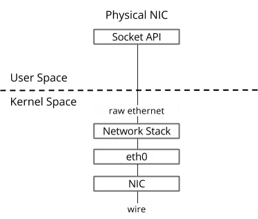
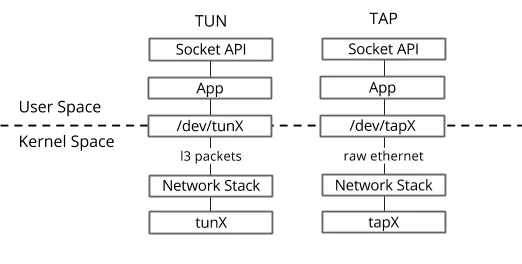
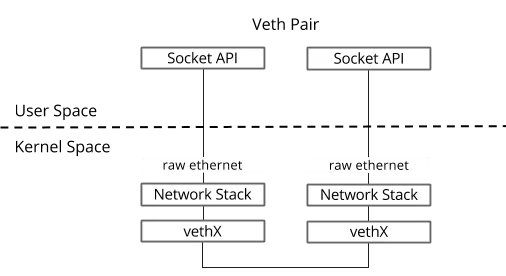
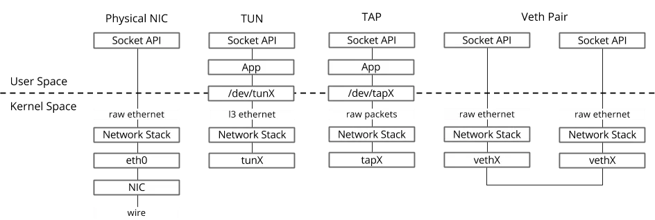

# linux cloud net

随着虚拟化技术的出现，网络也随之被虚拟化，相较于单一的物理网络，虚拟网络变得非常复杂，在一个主机系统里面，需要实现诸如交换、路由、隧道、隔离、聚合等多种网络功能。

而实现这些功能的基本元素就是虚拟的网络设备，比如 tap、tun 和 veth-pair。

> pic01

### tap/tun

tap/tun 提供了一台主机内用户空间的数据传输机制。它虚拟了一套网络接口，这套接口和物理的接口无任何区别，可以配置 IP，可以路由流量，不同的是，它的流量只在主机内流通。

tap/tun 有些许的不同，tun 只操作三层的 IP 包，而 tap 操作二层的以太网帧。

> pic02

### veth-pair

veth-pair 是成对出现的一种虚拟网络设备，一端连接着协议栈，一端连接着彼此，数据从一端出，从另一端进。

它的这个特性常常用来连接不同的虚拟网络组件，构建大规模的虚拟网络拓扑，比如连接 Linux Bridge、OVS、LXC 容器等。

一个很常见的案例就是它被用于 OpenStack Neutron，构建非常复杂的网络形态。

> pic03

### 总结

> Figure 4. Physical, TUN/TAP and Veth networking devices

