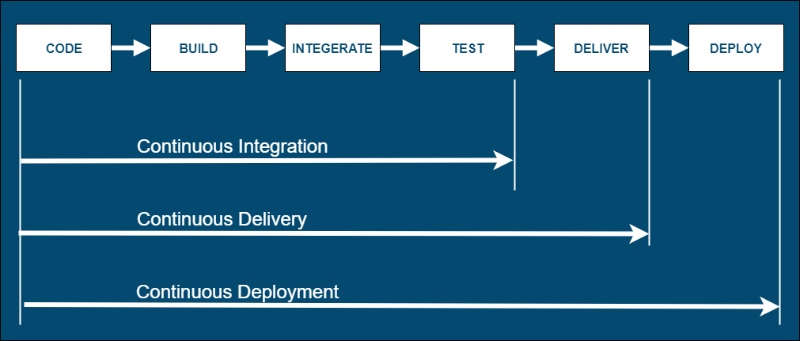
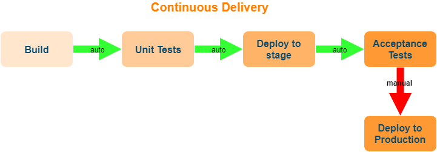
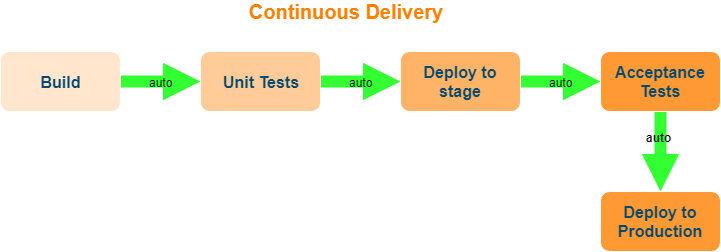

# CI/CD 

## 为啥搞CI/CD

我的见解，为了实现以下目的：

- 标准化
- 流程化
- 自动化

## 介绍

互联网软件的开发和发布，已经形成了一套标准流程，假如把开发工作流程分为以下几个阶段：

编码 --> 构建 --> 集成 --> 测试 --> 交付 --> 部署

正如你在上图中看到，[持续集成(Continuous Integration)]、[持续交付(Continuous Delivery)]和[持续部署(Continuous Deployment)]有着不同的软件自动化交付周期。

## 持续集成（CI）

上面整个流程中最重要的组成部分就是持续集成（Continuous integration，简称CI）。

**持续集成**指的是，频繁地（一天多次）将代码集成到主干。将软件个人研发的部分向软件整体部分交付，频繁进行集成以便更快地发现其中的错误。

### 没有持续集成

- 项目做模块集成的时候，发现很多借口都不通，浪费大量实践。

- 需要手动去编译打包最新的代码，构建过程不透明，没有标准化。

- 发布代码，上线，基本靠手工或脚本，没有流程化。

### 最佳实践

- 维护一个单一的代码库

- 使构建自动化

- 执行测试是构建的一部分

- 集成日志及历史记录

- 使用统一的依赖包管理库

- 每天至少集成一次，一则可以及时发现并定位错误，二则可以防止分支大幅偏离主干使得以后集成难度大幅增加

### CI工具

- Jenkins
- Gitlab-CI
- Travis-CI
- Bamboo

## 持续交付

持续交付（Continuous delivery）指的是，频繁地将软件的新版本，交付给质量团队或者用户，以供评审。如果评审通过，代码就进入生产阶段。

持续交付在持续集成的基础上，将集成后的代码部署到更贴近真实运行环境的「类生产环境」(production-like environments)中。持续交付优先于整个产品生命周期的软件部署，建立在高水平自动化持续集成之上。

持续交付可以看作持续集成的下一步。它强调的是，不管怎么更新，软件是随时随地可以交付的。

## 持续部署（CD）

**持续部署**（continuous deployment）是持续交付的下一步，指的是代码通过评审以后，自动部署到生产环境。

持续部署的目标是，代码在任何时刻都是可部署的，可以进入生产阶段。

持续部署的前提是能自动化完成测试、构建、部署等步骤。

