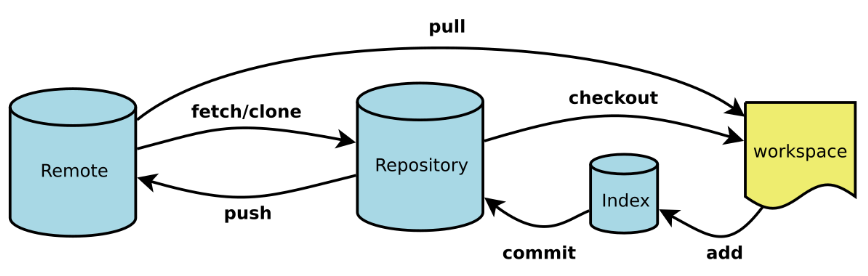

# git

[toc]


## .gitignore 配置说明

### 规则说明

| 语法 | 解释                                             |
| ---- | ------------------------------------------------ |
| #    | 在行首代表注释                                   |
| /    | 在行首代表根目录，不在行首匹配前面字符对应的目录 |
| *    | 通配多个字符                                     |
| **   | 匹配多级目录，可在开始，中间，结束               |
| ?    | 通配单个字符                                     |
| []   | 单个字符的匹配列表                               |
| !    | 不忽略(跟踪)匹配到的文件或目录                   |

### 常用规则示例

| 语法         | 解释                                                         |
| ------------ | ------------------------------------------------------------ |
| /*           | 忽略所有文件                                                 |
| !.gitignore  | 接上句，但不忽略.gitignore文件                               |
| file         | 会匹配目录 file 以及文件 file                                |
| file/        | 忽略目录 file 下的全部内容；不管是根目录下的 /file/目录，还是某个子目录/child/file/目录，都会被忽略，但不忽略文件 file |
| /file/       | 忽略根目录下的 /file/ 目录的全部内容                         |
| /*.c         | 忽略 cat.c，不忽略 build/cat.c                               |
| debug/*.obj  | 忽略 debug/io.obj，不忽略 debug/common/io.obj 和 tools/debug/io.obj |
| **/foo       | 忽略/foo, a/foo, a/b/foo等                                   |
| a/**/b       | 忽略a/b, a/x/b, a/x/y/b等                                    |
| !/bin/run.sh | 不忽略 bin 目录下的 run.sh 文件                              |
| *.log        | 忽略所有 .log 文件                                           |
| config.php   | 忽略当前路径的 config.php 文件                               |


### 在 Intellij IDEA 中配置 ignore

#### 安装插件

菜单栏依次点击： `File` --> `Settings` --> *Search(.ignore)* --> `install` --> 重启IDEA

#### 新建 `.gitignore` 文件

项目根目录依次点击： `右击` --> `New` --> `.ignore file` --> `.gitignore file(GIT)`

如果是 `Java` 项目，可选中：

- Example user template
- Java
- JetBrains

等，如果还有其他自定义需要加入的，直接打开编辑。

> 也可以右键选中该目录或者文件，然后点击 `Add to .gitignore file`。

保存后发现，.gitignore中的文件名在项目树显示为灰色。


## .gitignore not working

```
git rm -rf --cached .
git add .
git commit -an 'reset cached'
git push origin
```


## config

**non global config file**: ${working space}/.git/config

### first-time git setup

```
git config user.name "alice"
git config user.email "alice@example.com"

git config user.name
git config user.mail
```

### git config edit using editor

```
git config --edit --global
git config --edit --system
```

### git config list 

```
git config --list --global 
git config --list --system 
git config --list --show-origin
```

### credential

list all credential methods

```
git help -a | grep credential
```

for single project and store in memory

```
git config --unset credential.helper
git config credential.helper cache
```

for single project and store in disk

```
git config --unset credential.helper 
git config credential.helper store
```

for all project and config file

```
git config --global --unset credential.helper
git config --global credential.helper store
```

check for all configs

```
git config --list
```

fileMode

```
git config --get core.fileMode
git config --add core.fileMode false
```


## git remote

```
git remote add origin ${fork_of_upstream}
git remote add upstream ${upstream}
git remote get-url origin
git remote get-url upstream
git remote set-url origin ${fork_of_upstream}
git remote set-url upstream ${upstream}
git remote show
```


## git log

```
git log --pretty=oneline --abbrev-commit --graph
git log --graph --all --pretty=oneline --abbrev-commit
git log origin/master
```

show you the commits that are in the remote branch, but not in your current branch (`HEAD`).

```
git log HEAD..origin/branch
```

show you the commits that are in the upstream/master, but not in origin/master.

```
git log origin/master..upstream/master
```

show the diffs between remote branch and your current branch (`HEAD`).

```
git log HEAD..origin/branch
```


## git diff 

show the diffs between in workspace and in repository

```
git diff HEAD -- <filename>
```

show the diffs between local and remote

```
git diff master origin
```

show the diffs between origin/master and upstream/master

```
git diff origin/master..upstream/master
```


## workflow




## git checkout

> changes to modified files are discarded but untracked files are untouched

discard on one file

```
git checkout -- <file>
```

discard on current dir

```
git checkout .
```


## git clean

> untracked files are removed but modified files are unchanged

```
git clean -f
```


## git reset

> changes to modified files are discarded but untracked files are untouched

roll back to previous version

```
git reset --hard HEAD^
```

undo roll back to previous version

```
# get commit id of the version your want to revert using
git reflog
git reset --hard <commit-id>
```


## git rm

> remove caches in index zone

remove tracked dir/file

- alternative 1

  ```bash
  git rm -r --cached test/
  git commit -m "remove test/"
  ```

- alternative 2

  ```bash
  git rm -r --cached .
  git add .
  git commit -m 'update .gitignore'
  ```


## show difference

### against file

```
git show <rev> <file>
```

show the lastest specific revision of every line 

```
git blame <file>
```

show every commit of a specific file

```
git whatchanged <file>
```

### against revision

```
git show <rev>
git log -p <rev>
```


## How to keep your Git-Fork up to date(sync a fork)

When it comes to the situation that you fork a repository and you contribute to it, then it could happen that your fork and the upstream are not in sync anymore. So the goal is, that you get a current version of the upstream repository and then you can merge the new changes into your fork, right? Okay! Let’s get started.

### 1. Create a fork

Before you can keep your fork updated, you need a fork. Hint: A fork is a copy of someone others repository in your account, which can be an independent development project.

### 2. Clone the fork

Clone the fork as a regular repository, as you always do.

```
$ git clone git@github.com:stefanbauer/framework.git
```

### 3. Add the upstream

Now we should add the `upstream`. The original repository is mostly called “upstream”. In our case, we use Laravel for instance. `Cd` into your fork repository and add the upstream. You can call it however you want. Upstream is just best practice.

```
$ git remote add upstream git://github.com/laravel/framework.git
$ git remote -v
```

### 4. Keep the upstream updated

Now as we have both URLs get tracked, we can update the two sources independently. With

```
$ git fetch upstream
```

you can fetch all the stuff from the upstream.

### 5. Merge the upstream with your fork

Then you can just merge the changes.

```
$ git merge upstream/master master
```

With that, you merge the latest changes from the master branch of the upstream into your local master branch. If you like, you can also use `git pull`, which is nothing else than fetching and merging in one step.

**Pro Tip:** The best way in my eyes is, to rebase because that fetches the latest changes of the upstream branch and replay your work on top of that. Here is, how it works:

```
$ git rebase upstream/master
```

### 6. Push to you fork repo

```
git push origin
```


## difference between HEAD^ and HEAD~

- Use `~` most of the time — to go back a number of generations, usually what you want
- Use `^` on merge commits — because they have two or more (immediate) parents

```
G   H   I   J
 \ /     \ /
  D   E   F
   \  |  / \
    \ | /   |
     \|/    |
      B     C
       \   /
        \ /
         A
```

notations in the same line are equivalent

|      |      |         |        |       |
| ---- | ---- | ------- | ------ | ----- |
| A    |      | A^0     |        |       |
| B    | A^   | A^1     | A~1    |       |
| C    | A^2  |         |        |       |
| D    | A^^  | A^1^1   | A~2    |       |
| E    | B^2  | A^^2    |        |       |
| F    | B^3  | A^^3    |        |       |
| G    | A^^^ | A^1^1^1 | A~3    |       |
| H    | D^2  | B^^2    | A^^^2  | A~2^2 |
| I    | F^   | B^3^    | A^^3^  |       |
| J    | F^2  | B^3^2   | A^^3^2 |       |


## git init and add remote

### 1. generate SSH Key pair if not exists one

```
if [ ! -e ~/.ssh/id_rsa ]; then
	ssh-keygen
fi
```

### 2. copy public Key to remote server

copy newly generated public key onto git server under git account

```
ssh-copy-id -i ~/.ssh/id_rsa.pub git@remote.example.com
```

### 3. git init

```
mkdir workspace && cd $_
git init
echo "# readme" > README.md
# copy some dirs or files to current working directory as needed
git commit -am "docs: init repository"
```

### 4. create repo in github with same name

### 5. git remote

```
git remote add origin git@github.com:steve/workspace.git
```

### 6. git push

run git push with `-u` making association between origin (remote) and master (local), and you should only run without `-u` in the next push

```
git push -u origin master
```

check remote

```
git remote -v
```


## git clone

### 1 create repo in github 

### 2 create local workspace

```
mkdir ~/workspace
cd ~/workspace
```

### 3 git clone

```
git clone git@github.com:steveyes/repo.git
```


## git flow - branch merge

### 1 create branck

```
cd ~/workspace
git branch dev
git check -b dev
```

### 2 check current branch

```
git branch
```

###  3 made changes

```
git add README.md
git commit -m 'branch dev add README.md'
```

### 4 checkout to master

```
git checkout master
```

### 5 merge dev to master

```
git merge dev
```

### 6 remove branch dev

```
git branch -d dev
```

###  7 check current branch

```
git branch
```


## git conflict

readme.md

```
Creating a new branch is quick
```

create branch feature1 and switch to that branch

```
git checkout -b feature1
```

made some changes on feature1

```
Creating a new branch is quick AND simple.
```

commit on feature1

```
git add readme.md
git commit -m 'AND simple'
```

switch back to master and made some changes

```
git checkout master
```

readme.md

```
Create a new branch is quick & simple.
```

commit on master

```
git add readme.md
git commit -m '& simple'
```

git commit conflict between feature1 and master, made changes on readme.md and commit

readme.md

```
Creating a new branch is quick and simple.
```

commit 

```
git status
git add readme.md
git commit -m 'conflict fixed'
```

show log

```
git log --granph --pretty=oneline --abbrev-commit
```

delete branch feature1 and push master

```
git branch -d feature1
git push origin master
```

show diff

```
git diff
```


## change the commit author

### just for the next commit

```
git commit --author="John Doe <john@doe.org>"
```

### for past commit

> https://stackoverflow.com/questions/3042437/how-to-change-the-commit-author-for-one-specific-commit

```
# show git commit log
git log 
# For example, if your commit history is `A-B-C-D-E-F` with `F` as `HEAD`, 
# and you want to change the author of `C` and `D`, then you should run
git rebase -i B
# if you need to edit A, use git rebase -i --root
# Change the lines for both C and D from `pick` to `edit` and exit the editor
# Once the rebase started, it would first pause at C, You should run
git commit --amend --author="Author Name <email@address.com>"
# and then 
git rebase --continue
# It would pause again at D, hen you should run
git commit --amend --author="Author Name <email@address.com>" 
git rebase --continue
# ..., until the rebase complete
# Use git push -f to update your origin with the updated commits.
git push -f
```

### change author permanently

```
git config user.email "${new_email}"
```

