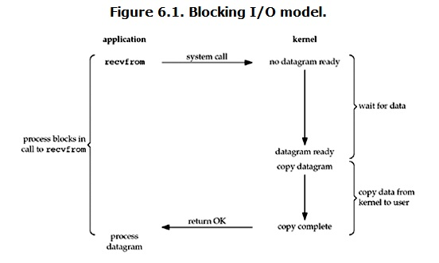

# IO multiplexing

> I/O多路复用（multiplexing）的本质是通过一种机制（系统内核缓冲I/O数据），让单个进程可以监视多个文件描述符，一旦某个描述符就绪（一般是读就绪或写就绪），能够通知程序进行相应的读写操作

select、poll 和 epoll 都是 Linux API 提供的 IO 复用方式。


## 基础的概念

### 用户空间 / 内核空间

现在操作系统都是采用虚拟存储器，那么对32位操作系统而言，它的寻址空间（虚拟存储空间）为4G（2的32次方）。
操作系统的核心是内核，独立于普通的应用程序，可以访问受保护的内存空间，也有访问底层硬件设备的所有权限。为了保证用户进程不能直接操作内核（kernel），保证内核的安全，操作系统将虚拟空间划分为两部分，一部分为内核空间，一部分为用户空间。

针对linux操作系统而言，将最高的1G字节（从虚拟地址0xC0000000到0xFFFFFFFF），供内核使用，称为内核空间，而将较低的3G字节（从虚拟地址0x00000000到0xBFFFFFFF），供各个进程使用，称为用户空间。

###  进程切换

为了控制进程的执行，内核必须有能力挂起正在CPU上运行的进程，并恢复以前挂起的某个进程的执行。这种行为被称为进程切换。因此可以说，任何进程都是在操作系统内核的支持下运行的，是与内核紧密相关的，并且进程切换是非常耗费资源的。

从一个进程的运行转到另一个进程上运行，这个过程中经过下面这些变化：

1. 保存处理机上下文，包括程序计数器和其他寄存器。
2. 更新PCB信息。
3. 把进程的PCB移入相应的队列，如就绪、在某事件阻塞等队列。
4. 选择另一个进程执行，并更新其PCB。
5. 更新内存管理的数据结构。
6. 恢复处理机上下文。

###  进程阻塞

正在执行的进程，由于期待的某些事件未发生，如请求系统资源失败、等待某种操作的完成、新数据尚未到达或无新工作做等，则由系统自动执行阻塞原语(Block)，使自己由运行状态变为阻塞状态。可见，进程的阻塞是进程自身的一种主动行为，也因此只有处于运行态的进程（获得了CPU资源），才可能将其转为阻塞状态。当进程进入阻塞状态，是不占用CPU资源的。

###  文件描述符

文件描述符（File descriptor）是计算机科学中的一个术语，是一个用于表述指向文件的引用的抽象化概念。
文件描述符在形式上是一个非负整数。实际上，它是一个索引值，指向内核为每一个进程所维护的该进程打开文件的记录表。当程序打开一个现有文件或者创建一个新文件时，内核向进程返回一个文件描述符。在程序设计中，一些涉及底层的程序编写往往会围绕着文件描述符展开。但是文件描述符这一概念往往只适用于UNIX、Linux这样的操作系统。

###  缓存I/O

缓存I/O又称为标准I/O，大多数文件系统的默认I/O操作都是缓存I/O。在Linux的缓存I/O机制中，操作系统会将I/O的数据缓存在文件系统的页缓存(page cache)中，即数据会先被拷贝到操作系统内核的缓冲区中，然后才会从操作系统内核的缓冲区拷贝到应用程序的地址空间。

**缓存 IO 的缺点：**数据在传输过程中需要在应用程序地址空间和内核进行多次数据拷贝操作，这些数据拷贝操作所带来的 CPU 以及内存开销是非常大的。


## Linux IO模型

网络IO的本质是socket的读取，socket在linux系统被抽象为流，IO可以理解为对流的操作。刚才说了，对于一次IO访问（以read举例），数据会先被拷贝到操作系统内核的缓冲区中，然后才会从操作系统内核的缓冲区拷贝到应用程序的地址空间。

所以说，当一个read操作发生时，它会经历两个阶段：

1. 第一阶段：等待数据准备 (Waiting for the data to be ready)。
2. 第二阶段：将数据从内核拷贝到进程中 (Copying the data from the kernel to the process)。

对于socket流而言：

1. 第一步：通常涉及等待网络上的数据分组到达，然后被复制到内核的某个缓冲区。
2. 第二步：把数据从内核缓冲区复制到应用进程缓冲区。


正式因为这两个阶段，linux系统产生了下面五种网络模型的方案。

Unix五种IO模型（网络IO的模型）

- blocking IO - 阻塞IO
- nonblocking IO - 非阻塞IO
- IO multiplexing - IO多路复用
- signal driven IO - 信号驱动IO
- asynchronous IO - 异步IO

> **由于signal driven IO在实际中并不常用，所以我这只提及剩下的四种IO Model。**

其中前面4种IO都可以归类为synchronous IO - 同步IO，而select、poll、epoll本质上也都是同步I/O，因为他们都需要在读写事件就绪后自己负责进行读写，也就是说这个读写过程是阻塞的。

与多进程和多线程技术相比，I/O多路复用技术的最大优势是系统开销小，系统不必创建进程/线程，也不必维护这些进程/线程，从而大大减小了系统的开销。

### 阻塞 I/O（blocking IO）



当用户进程调用了recvfrom这个系统调用，kernel就开始了IO的第一个阶段：准备数据（对于网络IO来说，很多时候数据在一开始还没有到达。比如，还没有收到一个完整的UDP包。这个时候kernel就要等待足够的数据到来）。这个过程需要等待，也就是说数据被拷贝到操作系统内核的缓冲区中是需要一个过程的。而在用户进程这边，整个进程会被阻塞（当然，是进程自己选择的阻塞）。

当kernel一直等到数据准备好了，它就会将数据从kernel中拷贝到用户内存，然后kernel返回结果，用户进程才解除block的状态，重新运行起来。

> **所以，blocking IO的特点就是在IO执行的两个阶段都被block了。**

### 非阻塞 I/O（nonblocking IO）

linux下，可以通过设置socket使其变为non-blocking。当对一个non-blocking socket执行读操作时，流程是这个样子：


当用户进程发出read操作时，如果kernel中的数据还没有准备好，那么它并不会block用户进程，而是立刻返回一个error。从用户进程角度讲 ，它发起一个read操作后，并不需要等待，而是马上就得到了一个结果。用户进程判断结果是一个error时，它就知道数据还没有准备好，于是它可以再次发送read操作。一旦kernel中的数据准备好了，并且又再次收到了用户进程的system call，那么它马上就将数据拷贝到了用户内存，然后返回。

> **所以，nonblocking IO的特点是用户进程需要不断的主动询问kernel数据好了没有。**

### I/O 多路复用（ IO multiplexing）

IO multiplexing就是我们说的select，poll，epoll，有些地方也称这种IO方式为event driven IO。select/epoll的好处就在于单个process就可以同时处理多个网络连接的IO。它的基本原理就是select，poll，epoll这个function会不断的轮询所负责的所有socket，当某个socket有数据到达了，就通知用户进程。


当用户进程调用了select，那么整个进程会被block，而同时，kernel会“监视”所有select负责的socket，当任何一个socket中的数据准备好了，select就会返回。这个时候用户进程再调用read操作，将数据从kernel拷贝到用户进程。

> 所以，I/O 多路复用的特点是通过一种机制使一个进程能同时等待多个文件描述符，而这些文件描述符（套接字描述符）其中的任意一个进入读就绪状态，select()函数就可以返回。

这个图和blocking IO的图其实并没有太大的不同，事实上，还更差一些。因为这里需要使用两个system call (select 和 recvfrom)，而blocking IO只调用了一个system call (recvfrom)。但是，用select的优势在于它可以同时处理多个connection。

所以，如果处理的连接数不是很高的话，使用select/epoll的web server不一定比使用multi-threading + blocking IO的web server性能更好，可能延迟还更大。select/epoll的优势并不是对于单个连接能处理得更快，而是在于能处理更多的连接。）

在IO multiplexing Model中，实际中，对于每一个socket，一般都设置成为non-blocking，但是，如上图所示，整个用户的process其实是一直被block的。只不过process是被select这个函数block，而不是被socket IO给block。

### 异步 I/O（asynchronous IO）

linux下的asynchronous IO其实用得很少。先看一下它的流程：


用户进程发起read操作之后，立刻就可以开始去做其它的事。而另一方面，从kernel的角度，当它受到一个asynchronous read之后，首先它会立刻返回，所以不会对用户进程产生任何block。然后，kernel会等待数据准备完成，然后将数据拷贝到用户内存，当这一切都完成之后，kernel会给用户进程发送一个signal，告诉它read操作完成了。

### blocking和non-blocking的区别

调用blocking IO会一直block住对应的进程直到操作完成，而non-blocking IO在kernel还在准备数据的情况下会立刻返回。

### synchronous IO和asynchronous IO的区别

在说明synchronous IO和asynchronous IO的区别之前，需要先给出两者的定义。POSIX的定义是这样子的：

- A synchronous I/O operation causes the requesting process to be blocked until that I/O operation completes;
- An asynchronous I/O operation does not cause the requesting process to be blocked;

两者的区别就在于synchronous IO做”IO operation”的时候会将process阻塞。按照这个定义，之前所述的blocking IO，non-blocking IO，IO multiplexing都属于synchronous IO。

有人会说，non-blocking IO并没有被block啊。这里有个非常“狡猾”的地方，定义中所指的”IO operation”是指真实的IO操作，就是例子中的recvfrom这个system call。non-blocking IO在执行recvfrom这个system call的时候，如果kernel的数据没有准备好，这时候不会block进程。但是，当kernel中数据准备好的时候，recvfrom会将数据从kernel拷贝到用户内存中，这个时候进程是被block了，在这段时间内，进程是被block的。

而asynchronous IO则不一样，当进程发起IO 操作之后，就直接返回再也不理睬了，直到kernel发送一个信号，告诉进程说IO完成。在这整个过程中，进程完全没有被block。

### 各个IO Model的比较如图所示


通过上面的图片，可以发现non-blocking IO和asynchronous IO的区别还是很明显的。在non-blocking IO中，虽然进程大部分时间都不会被block，但是它仍然要求进程去主动的check，并且当数据准备完成以后，也需要进程主动的再次调用recvfrom来将数据拷贝到用户内存。而asynchronous IO则完全不同。它就像是用户进程将整个IO操作交给了他人（kernel）完成，然后他人做完后发信号通知。在此期间，用户进程不需要去检查IO操作的状态，也不需要主动的去拷贝数据。


## Linux的socket 事件wakeup callback机制

言归正传，在介绍select、poll、epoll前，有必要说说linux(2.6+)内核的事件wakeup callback机制，这是IO多路复用机制存在的本质。Linux通过socket睡眠队列来管理所有等待socket的某个事件的process，同时通过wakeup机制来异步唤醒整个睡眠队列上等待事件的process，通知process相关事件发生。通常情况，socket的事件发生的时候，其会顺序遍历socket睡眠队列上的每个process节点，调用每个process节点挂载的callback函数。在遍历的过程中，如果遇到某个节点是排他的，那么就终止遍历，总体上会涉及两大逻辑：

1. 睡眠等待逻辑；
2. 唤醒逻辑。

### 睡眠等待逻辑：涉及select、poll、epoll_wait的阻塞等待逻辑

1. select、poll、epoll_wait陷入内核，判断监控的socket是否有关心的事件发生了，如果没，则为当前process构建一个wait_entry节点，然后插入到监控socket的sleep_list
2. 进入循环的schedule直到关心的事件发生了
3. 关心的事件发生后，将当前process的wait_entry节点从socket的sleep_list中删除

### 唤醒逻辑：

1. socket的事件发生了，然后socket顺序遍历其睡眠队列，依次调用每个wait_entry节点的callback函数
2. 直到完成队列的遍历或遇到某个wait_entry节点是排他的才停止
3. 一般情况下callback包含两个逻辑：1.wait_entry自定义的私有逻辑；2.唤醒的公共逻辑，主要用于将该wait_entry的process放入CPU的就绪队列，让CPU随后可以调度其执行


## PPC模型和TPC模型

PPC（Process Per Connection）模型和TPC（Thread Per Connection）模型的设计思想类似，就是给每一个到来的连接都分配一个独立的进程或者线程来服务。对于这两种模型，其需要耗费较大的时间和空间资源。当管理连接数较多时，进程或线程的切换开销较大。因此，这类模型能接受的最大连接数都不会高，一般都在几百个左右。


## Select

select 函数监视的文件描述符分3类，分别是writefds、readfds、和exceptfds。调用后select函数会阻塞，直到有描述副就绪（有数据 可读、可写、或者有except），或者超时（timeout指定等待时间，如果立即返回设为null即可），函数返回。当select函数返回后，可以 通过遍历fdset，来找到就绪的描述符。

select目前几乎在所有的平台上支持，其良好跨平台支持也是它的一个优点。select的一 个缺点在于单个进程能够监视的文件描述符的数量存在最大限制，在Linux上一般为1024，可以通过修改宏定义甚至重新编译内核的方式提升这一限制，但 是这样也会造成效率的降低。

### select函数分析

```c
int select(int maxfdp1, fd_set *readset, fd_set *writeset, fd_set *exceptset, const struct timeval *timeout);
```

**类型分析**

- `fd_set` 可以理解为一个集合，这个集合中存放的是文件描述符(file descriptor)，即文件句柄。
- `timeval` 结构用于指定这段时间的秒数和微秒数。

**形参分析**

- `int maxfdp1` 指定待测试的文件描述字个数，它的值是待测试的最大描述字加1。
- `fd_set *readset` 内核测试读的文件描述符集合
- `fd_set *writeset`  内核测试写的文件描述符集合
- `fd_set *exceptset` 内核测试异常条件的文件描述符集合
- `const struct timeval *timeout`  timeout** 告知内核等待所指定文件描述符集合中的任何一个就绪可花多少时间

**返回值**

- -1 - 出错
- 0 - 超时
- \>1 - 就绪描述符数目

### select运行机制

select()的机制中提供一种 `fd_set` 的数据结构，实际上是一个long类型的数组，每一个数组元素都能与一打开的文件句柄（不管是Socket句柄,还是其他文件或命名管道或设备句柄）建立联系，建立联系的工作由程序员完成。

当用户process调用select()的时候，select会将需要监控的readfds集合拷贝到内核空间（假设监控的仅仅是socket可读），然后遍历自己监控的socket sk，挨个调用sk的poll逻辑以便检查该sk是否有可读事件，遍历完所有的sk后，如果没有任何一个sk可读，那么select会调用schedule_timeout进入schedule循环，使得process进入睡眠。如果在timeout时间内某个sk上有数据可读了，或者等待timeout了，则调用select的process会被唤醒，接下来select就是遍历监控的sk集合，挨个收集可读事件并返回给用户了。

从流程上来看，使用select函数进行IO请求和同步阻塞模型没有太大的区别，甚至还多了添加监视socket，以及调用select函数的额外操作，效率更差。但是，使用select以后最大的优势是用户可以在一个线程内同时处理多个socket的IO请求。用户可以注册多个socket，然后不断地调用select读取被激活的socket，即可达到在同一个线程内同时处理多个IO请求的目的。而在同步阻塞模型中，必须通过多线程的方式才能达到这个目的。

### select机制的弊端

1. **内核/用户空间内存拷贝问题**： 每次调用select，都需要把 `fd_set` 集合从用户态拷贝到内核态，如果 `fd_set` 集合很大时，那这个开销也很大
2. **返回的是含有整个句柄的数组**：被监控的fds集合中，应用程序需要遍历整个数组才能发现哪些句柄发生了事件，也就是说只要有一个可读事件，整个socket集合就会被遍历一次调用sk的poll函数收集可读事件，由于当初的需求仅仅关心是否有数据可读这样一个事件，当事件通知来的时候，由于数据的到来是异步的，我们不知道事件来的时候，有多少个被监控的socket有数据可读了，于是，只能挨个遍历每个socket来收集可读事件，如果 `fd_set` 集合很大时，那这个开销也很大
3. **最大并发限制**： 为了减少数据拷贝带来的性能损坏，内核对被监控的 `fd_set` 集合大小做了限制，并且这个是通过宏控制的，大小不可改变(限制为1024)
4. **触发方式是水平触发**：应用程序如果没有完成对一个已经就绪的文件描述符进行IO操作，那么之后每次select调用还是会将这些文件描述符通知进程。

### 弊端如何解决

1. fds集合需要从用户空间拷贝到内核空间的问题，我们希望不需要拷贝
2. 当被监控的fds中某些有数据可读的时候，我们希望通知更加精细一点，就是我们希望能够从通知中得到有可读事件的fds列表，而不是需要遍历整个fds来收集
3. 被监控的fds集合限制为1024，1024太小了，我们希望能够有个比较大的可监控fds集合


## POLL

对于select，poll没有改进或者依然相同的：

- 大量描述符数组被整体复制于用户态和内核态的地址空间之间，多个描述符也是进行轮询
- 个别描述符就绪触发整体描述符集合的遍历

对于select，poll的改进：

- poll改变了fds集合的描述方式，使用了pollfd结构而不是select的fd_set结构，poll底层使用链表，select底层使用数组，使得poll支持的fds集合限制远大于select的1024。

也就是说，poll只解决了上面的问题3，并没有解决问题1，2的性能开销问题。

### poll函数分析

```c
int poll(struct pollfd *fds, unsigned int nfds, int timeout);

typedef struct pollfd {
        int fd;                         // 需要被检测或选择的文件描述符
        short events;                   // 对文件描述符fd上感兴趣的事件
        short revents;                  // 文件描述符fd上当前实际发生的事件
} pollfd_t;
```

**类型分析**

- 一个`pollfd`结构体表示一个被监视的文件描述符，通过传递`fds`指示 poll() 监视多个文件描述符。
  - 其中，结构体的`events`域是监视该文件描述符的事件掩码，
  - 由用户来设置这个域，结构体的`revents`域是文件描述符的操作结果事件掩码，内核在调用返回时设置这个域

**形参分析**

- `struct pollfd *fds -` - `fds`是一个`struct pollfd`类型的数组，用于存放需要检测其状态的socket描述符，并且调用poll函数之后`fds`数组不会被清空；
- `nfds_t nfds` - 记录数组`fds`中描述符的总数量

**返回值**

- -1 - 出错
- 0 - 超时
- \>1 - `fds`中描述符的总数量


## Epoll

在计算机行业中，有两种解决问题的思想：

1. 计算机科学领域的任何问题, 都可以通过添加一个中间层来解决
2. 变集中(中央)处理为分散(分布式)处理

epoll在解决select的遗留问题(1)和(2)的时候，怎么运用这两个思想的

### fds集合拷贝问题的解决

对于IO多路复用，有两件事是必须要做的(对于监控可读事件而言)：

1. 准备好需要监控的fds集合；
2. 探测并返回fds集合中哪些fd可读了。

细看select或poll的函数原型，我们会发现，每次调用select或poll都在重复地准备(集中处理)整个需要监控的fds集合。然而对于频繁调用的select或poll而言，fds集合的变化频率要低得多，我们没必要每次都重新准备(集中处理)整个fds集合。

于是，epoll引入了epoll_ctl系统调用，将高频调用的epoll_wait和低频的epoll_ctl隔离开。同时，epoll_ctl通过(EPOLL_CTL_ADD、EPOLL_CTL_MOD、EPOLL_CTL_DEL)三个操作来分散对需要监控的fds集合的修改，做到了有变化才变更，将select或poll高频、大块内存拷贝(集中处理)变成epoll_ctl的低频、小块内存的拷贝(分散处理)，避免了大量的内存拷贝。同时，对于高频epoll_wait的可读就绪的fd集合返回的拷贝问题，epoll通过内核与用户空间mmap(内存映射)同一块内存来解决。mmap将用户空间的一块地址和内核空间的一块地址同时映射到相同的一块物理内存地址（不管是用户空间还是内核空间都是虚拟地址，最终要通过地址映射映射到物理地址），使得这块物理内存对内核和对用户均可见，减少用户态和内核态之间的数据交换。

另外，epoll通过epoll_ctl来对监控的fds集合来进行增、删、改，那么必须涉及到fd的快速查找问题，于是，一个低时间复杂度的增、删、改、查的数据结构来组织被监控的fds集合是必不可少的了。在linux 2.6.8之前的内核，epoll使用hash来组织fds集合，于是在创建epoll fd的时候，epoll需要初始化hash的大小。于是epoll_create(int size)有一个参数size，以便内核根据size的大小来分配hash的大小。在linux 2.6.8以后的内核中，epoll使用红黑树来组织监控的fds集合，于是epoll_create(int size)的参数size实际上已经没有意义了。

### 按需遍历就绪的fds集合

通过上面的socket的睡眠队列唤醒逻辑我们知道，socket唤醒睡眠在其睡眠队列的wait_entry(process)的时候会调用wait_entry的回调函数callback，并且，我们可以在callback中做任何事情。为了做到只遍历就绪的fd，我们需要有个地方来组织那些已经就绪的fd。

为此，epoll引入了一个中间层，一个双向链表(ready_list)，一个单独的睡眠队列(single_epoll_wait_list)。并且，与select或poll不同的是，epoll的process不需要同时插入到多路复用的socket集合的所有睡眠队列中，相反process只是插入到中间层的epoll的单独睡眠队列中，process睡眠在epoll的单独队列上，等待事件的发生。同时，引入一个中间的wait_entry_sk，它与某个socket sk密切相关，wait_entry_sk睡眠在sk的睡眠队列上，其callback函数逻辑是将当前sk排入到epoll的ready_list中，并唤醒epoll的single_epoll_wait_list。而single_epoll_wait_list上睡眠的process的回调函数就明朗了：遍历ready_list上的所有sk，挨个调用sk的poll函数收集事件，然后唤醒process从epoll_wait返回。

### 调用顺序

1. 调用 epoll_create() 建立一个epoll对象(在epoll文件系统中为这个句柄对象分配资源)
2. 调用 epoll_ctl() 向epoll对象中添加这100万个连接的套接字
3. 调用 epoll_wait() 收集发生的事件的连接


### epoll_create函数分析

```c
#include <sys/epoll.h>

int epoll_create(int size);
```

`epoll_create` 函数创建一个epoll的句柄，size用来告诉内核这个监听的数目一共有多大，这个参数不同于select()中的第一个参数，给出最大监听的fd+1的值，参数size并不是限制了epoll所能监听的描述符最大个数，只是对内核初始分配内部数据结构的一个建议。

当创建好epoll句柄后，它就会占用一个fd值，在linux下如果查看/proc/进程id/fd/，是能够看到这个fd的，所以在使用完epoll后，必须调用close()关闭，否则可能导致fd被耗尽。

可以设置的最大上限在1GB内存的机器上大约是10万左 右，具体数目可以cat /proc/sys/fs/file-max察看,一般来说这个数目和系统内存关系很大。

### epoll_ctl 函数分析

```c
#include <sys/epoll.h>

int epoll_ctl(int epfd, int op, int fd, struct epoll_event *event);
```

- `epfd` 表示epoll句柄，由 epoll_create 产生
- `op` 表示fd操作类型，用三个宏来表示
  - `EPOLL_CTL_ADD` 注册新的fd到epfd中
  - `EPOLL_CTL_MOD` 修改已注册的fd的监听事件
  - `EPOLL_CTL_DEL` 从epfd中删除一个fd
- `fd` 是要监听的描述符
-  `event` 表示要监听的事件


### epoll_wait 函数分析


```c
#include <sys/epoll.h>

int epoll_wait(int epfd, struct epoll_event * events, int maxevents, int timeout);
```

**epoll_wait** 函数等待事件的就绪，成功时返回就绪的事件数目，调用失败时返回 -1，等待超时返回 0。

**形参分析**

- `epfd` 是epoll句柄
- `events` 表示从内核得到的就绪事件集合
- `maxevents` 告诉内核events的大小，不能大于创建epoll_create()时的size
- `timeout` 表示等待的超时时间（毫秒，0会立即返回，-1将不确定，也有说法说是永久阻塞）

**返回值**

- -1 - 出错
- 0 - 超时


### epoll_event 结构体代码

```
struct epoll_event {
    __uint32_t events;  /* Epoll events */
    epoll_data_t data;  /* User data variable */
};

typedef union epoll_data {
    void *ptr;
    int fd;
    __uint32_t u32;
    __uint64_t u64;
} epoll_data_t;
```

events可以是以下几个宏的集合

- EPOLLIN ：表示对应的文件描述符可以读（包括对端SOCKET）；
- EPOLLOUT：表示对应的文件描述符可以写；
- EPOLLPRI：表示对应的文件描述符有紧急的数据可读（带外数据）；
- EPOLLERR：表示对应的文件描述符发生错误；
- EPOLLHUP：表示对应的文件描述符被挂断；
- EPOLLET： 将EPOLL设为边缘触发(Edge Triggered)模式，这是相对于水平触发(Level Triggered)来说的。
- EPOLLONESHOT：只监听一次事件，当监听完这次事件之后，如果还需要继续监听这个socket的话，需要再次把这个socket加入到EPOLL队列里


### 实现机制

当某一进程调用epoll_create方法时，Linux内核会创建一个eventpoll结构体，这个结构体中有两个成员与epoll的使用方式密切相关。eventpoll结构体如下所示：

```c
struct eventpoll{
    ....
    /*红黑树的根节点，这颗树中存储着所有添加到epoll中的需要监控的事件*/
    struct rb_root  rbr;
    /*双链表中则存放着将要通过epoll_wait返回给用户的满足条件的事件*/
    struct list_head rdlist;
    ....
};
```

每一个epoll对象都有一个独立的eventpoll结构体，用于存放通过epoll_ctl方法向epoll对象中添加进来的事件。这些事件都会挂载在红黑树中，如此，重复添加的事件就可以通过红黑树而高效的识别出来(红黑树的插入时间效率是lgn，其中n为树的高度)。

而所有添加到epoll中的事件都会与设备(网卡)驱动程序建立回调关系，也就是说，当相应的事件发生时会调用这个回调方法。这个回调方法在内核中叫 `ep_poll_callback`,它会将发生的事件添加到rdlist双链表中。

在epoll中，对于每一个事件，都会建立一个epitem结构体，如下所示：

```c
struct epitem{
    struct rb_node  rbn;//红黑树节点
    struct list_head    rdllink;//双向链表节点
    struct epoll_filefd  ffd;  //事件句柄信息
    struct eventpoll *ep;    //指向其所属的eventpoll对象
    struct epoll_event event; //期待发生的事件类型
} 
```

当调用epoll_wait检查是否有事件发生时，只需要检查eventpoll对象中的rdlist双链表中是否有epitem元素即可。如果rdlist不为空，则把发生的事件复制到用户态，同时将事件数量返回给用户。


**从上面的讲解可知：通过红黑树和双链表数据结构，并结合回调机制，造就了epoll的高效。**

OK，讲解完了Epoll的机理，我们便能很容易掌握epoll的用法了。一句话描述就是：三步曲。

1. epoll_create()系统调用。此调用返回一个句柄，之后所有的使用都依靠这个句柄来标识。
2. epoll_ctl()系统调用。通过此调用向epoll对象中添加、删除、修改感兴趣的事件，返回0标识成功，返回-1表示失败。
3. epoll_wait()系统调用。通过此调用收集收集在epoll监控中已经发生的事件。

### 工作模式

epoll除了提供select/poll那种IO事件的水平触发（Level Triggered）外，还提供了边缘触发（Edge Triggered），这就使得用户空间程序有可能缓存IO状态，减少epoll_wait/epoll_pwait的调用，提高应用程序效率。

#### LT模式

.socket接收缓冲区不为空，有数据可读，则读事件一直触发。

.socket发送缓冲区不满可以继续写入数据，则写事件一直触发。

符合思维习惯，epoll_wait返回的事件就是socket的状态。

LT(level triggered)是缺省的工作方式，同时支持block和no-block socket。在这种做法中，当调用epoll_wait检测到某描述符事件就绪并通知应用程序时，内核告诉你一个文件描述符是否就绪了，然后你可以对这个就绪的fd进行IO操作。下次调用epoll_wait时，如果你不作任何操作，内核还是会继续通知你的。

#### ET模式

.socket的接收缓冲区状态变化时触发读事件，即空的接收缓冲区刚接收到数据时触发读事件。

.socket的发送缓冲区状态变化时触发写事件，即满的缓冲区刚空出空间时触发读事件。

仅在缓冲区状态变化时触发事件，比如数据缓冲去从无到有的时候(不可读-可读)。

ET(edge-triggered)是高速工作方式，只支持no-block socket。当epoll_wait检测到某描述符事件就绪并通知应用程序时，内核通过epoll告诉你，然后它会假设你知道文件描述符已经就绪，应用程序必须立即处理该事件，并且不会再为那个文件描述符发送更多的就绪通知，直到你做了某些操作导致那个文件描述符不再为就绪状态了(比如，你在发送，接收或者接收请求，或者发送接收的数据少于一定量时导致了一个EWOULDBLOCK 错误）。但是请注意，如果不处理，一直不对这个fd作IO操作(从而导致它再次变成未就绪)，下次调用epoll_wait时，不会再次通知此事件，内核不会发送更多的通知(only once)。

ET模式在很大程度上减少了epoll事件被重复触发的次数，因此效率要比LT模式高。epoll工作在ET模式的时候，必须使用非阻塞套接口，以避免由于一个文件句柄的阻塞读/阻塞写操作把处理多个文件描述符的任务饿死。

LT和ET原本应该是用于脉冲信号的，可能用它来解释更加形象。Level和Edge指的就是触发点，Level为只要处于水平，那么就一直触发，而Edge则为上升沿和下降沿的时候触发。比如：0->1 就是Edge，1->1 就是Level。

ET模式很大程度上减少了epoll事件的触发次数，因此效率比LT模式下高。

### 关于工作模式举个例子

假如有这样一个例子：

1. 我们已经把一个用来从管道中读取数据的文件句柄(RFD)添加到epoll描述符
2. 这个时候从管道的另一端被写入了2KB的数据
3. 调用epoll_wait(2)，并且它会返回RFD，说明它已经准备好读取操作
4. 然后我们读取了1KB的数据
5. 调用epoll_wait(2)......

**LT模式：**
如果是LT模式，那么在第5步调用epoll_wait(2)之后，仍然能受到通知。

**ET模式：**
 如果我们在第1步将RFD添加到epoll描述符的时候使用了EPOLLET标志，那么在第5步调用epoll_wait(2)之后将有可能会挂起，因为剩余的数据还存在于文件的输入缓冲区内，而且数据发出端还在等待一个针对已经发出数据的反馈信息。只有在监视的文件句柄上发生了某个事件的时候 ET 工作模式才会汇报事件。因此在第5步的时候，调用者可能会放弃等待仍在存在于文件输入缓冲区内的剩余数据。

当使用epoll的ET模型来工作时，当产生了一个EPOLLIN事件后，
读数据的时候需要考虑的是当recv()返回的大小如果等于请求的大小，那么很有可能是缓冲区还有数据未读完，也意味着该次事件还没有处理完，所以还需要再次读取：

### EAGAIN

Linux环境下开发经常会碰到很多错误(设置errno)，其中EAGAIN是其中比较常见的一个错误(比如用在非阻塞操作中)。
从字面上来看，是提示再试一次。这个错误经常出现在当应用程序进行一些非阻塞(non-blocking)操作(对文件或socket)的时候。

例如，以 O_NONBLOCK的标志打开文件/socket/FIFO，如果你连续做read操作而没有数据可读。此时程序不会阻塞起来等待数据准备就绪返回，read函数会返回一个错误EAGAIN，提示你的应用程序现在没有数据可读请稍后再试。
又例如，当一个系统调用(比如fork)因为没有足够的资源(比如虚拟内存)而执行失败，返回EAGAIN提示其再调用一次(也许下次就能成功)。

### epoll总结

在 select/poll中，进程只有在调用一定的方法后，内核才对所有监视的文件描述符进行扫描，而epoll事先通过epoll_ctl()来注册一 个文件描述符，一旦基于某个文件描述符就绪时，内核会采用类似callback的回调机制，迅速激活这个文件描述符，当进程调用epoll_wait() 时便得到通知。此处去掉了遍历文件描述符，而是通过监听回调的的机制。这正是epoll的魅力所在。

如果没有大量的idle -connection或者dead-connection，epoll的效率并不会比select/poll高很多，但是当遇到大量的idle- connection，就会发现epoll的效率大大高于select/poll。

### epoll demo

```c
#include <sys/socket.h>  
#include <sys/epoll.h>  
#include <netinet/in.h>  
#include <arpa/inet.h>  
#include <fcntl.h>  
#include <unistd.h>  
#include <stdio.h>  
#include <errno.h>  
#include <iostream>  
using namespace std;  
#define MAX_EVENTS 500  
struct myevent_s  
{  
    int fd;  
    void (*call_back)(int fd, int events, void *arg);  
    int events;  
    void *arg;  
    int status; // 1: in epoll wait list, 0 not in  
    char buff[128]; // recv data buffer  
    int len, s_offset;  
    long last_active; // last active time  
};  
// set event  
void EventSet(myevent_s *ev, int fd, void (*call_back)(int, int, void*), void *arg)  
{  
    ev->fd = fd;  
    ev->call_back = call_back;  
    ev->events = 0;  
    ev->arg = arg;  
    ev->status = 0;
    bzero(ev->buff, sizeof(ev->buff));
    ev->s_offset = 0;  
    ev->len = 0;
    ev->last_active = time(NULL);  
}  
// add/mod an event to epoll  
void EventAdd(int epollFd, int events, myevent_s *ev)  
{  
    struct epoll_event epv = {0, {0}};  
    int op;  
    epv.data.ptr = ev;  
    epv.events = ev->events = events;  
    if(ev->status == 1){  
        op = EPOLL_CTL_MOD;  
    }  
    else{  
        op = EPOLL_CTL_ADD;  
        ev->status = 1;  
    }  
    if(epoll_ctl(epollFd, op, ev->fd, &epv) < 0)  
        printf("Event Add failed[fd=%d], evnets[%d]\n", ev->fd, events);  
    else  
        printf("Event Add OK[fd=%d], op=%d, evnets[%0X]\n", ev->fd, op, events);  
}  
// delete an event from epoll  
void EventDel(int epollFd, myevent_s *ev)  
{  
    struct epoll_event epv = {0, {0}};  
    if(ev->status != 1) return;  
    epv.data.ptr = ev;  
    ev->status = 0;
    epoll_ctl(epollFd, EPOLL_CTL_DEL, ev->fd, &epv);  
}  
int g_epollFd;  
myevent_s g_Events[MAX_EVENTS+1]; // g_Events[MAX_EVENTS] is used by listen fd  
void RecvData(int fd, int events, void *arg);  
void SendData(int fd, int events, void *arg);  
// accept new connections from clients  
void AcceptConn(int fd, int events, void *arg)  
{  
    struct sockaddr_in sin;  
    socklen_t len = sizeof(struct sockaddr_in);  
    int nfd, i;  
    // accept  
    if((nfd = accept(fd, (struct sockaddr*)&sin, &len)) == -1)  
    {  
        if(errno != EAGAIN && errno != EINTR)  
        {  
        }
        printf("%s: accept, %d", __func__, errno);  
        return;  
    }  
    do  
    {  
        for(i = 0; i < MAX_EVENTS; i++)  
        {  
            if(g_Events[i].status == 0)  
            {  
                break;  
            }  
        }  
        if(i == MAX_EVENTS)  
        {  
            printf("%s:max connection limit[%d].", __func__, MAX_EVENTS);  
            break;  
        }  
        // set nonblocking
        int iret = 0;
        if((iret = fcntl(nfd, F_SETFL, O_NONBLOCK)) < 0)
        {
            printf("%s: fcntl nonblocking failed:%d", __func__, iret);
            break;
        }
        // add a read event for receive data  
        EventSet(&g_Events[i], nfd, RecvData, &g_Events[i]);  
        EventAdd(g_epollFd, EPOLLIN, &g_Events[i]);  
    }while(0);  
    printf("new conn[%s:%d][time:%d], pos[%d]\n", inet_ntoa(sin.sin_addr),
            ntohs(sin.sin_port), g_Events[i].last_active, i);  
}  
// receive data  
void RecvData(int fd, int events, void *arg)  
{  
    struct myevent_s *ev = (struct myevent_s*)arg;  
    int len;  
    // receive data
    len = recv(fd, ev->buff+ev->len, sizeof(ev->buff)-1-ev->len, 0);    
    EventDel(g_epollFd, ev);
    if(len > 0)
    {
        ev->len += len;
        ev->buff[len] = '\0';  
        printf("C[%d]:%s\n", fd, ev->buff);  
        // change to send event  
        EventSet(ev, fd, SendData, ev);  
        EventAdd(g_epollFd, EPOLLOUT, ev);  
    }  
    else if(len == 0)  
    {  
        close(ev->fd);  
        printf("[fd=%d] pos[%d], closed gracefully.\n", fd, ev-g_Events);  
    }  
    else  
    {  
        close(ev->fd);  
        printf("recv[fd=%d] error[%d]:%s\n", fd, errno, strerror(errno));  
    }  
}  
// send data  
void SendData(int fd, int events, void *arg)  
{  
    struct myevent_s *ev = (struct myevent_s*)arg;  
    int len;  
    // send data  
    len = send(fd, ev->buff + ev->s_offset, ev->len - ev->s_offset, 0);
    if(len > 0)  
    {
        printf("send[fd=%d], [%d<->%d]%s\n", fd, len, ev->len, ev->buff);
        ev->s_offset += len;
        if(ev->s_offset == ev->len)
        {
            // change to receive event
            EventDel(g_epollFd, ev);  
            EventSet(ev, fd, RecvData, ev);  
            EventAdd(g_epollFd, EPOLLIN, ev);  
        }
    }  
    else  
    {  
        close(ev->fd);  
        EventDel(g_epollFd, ev);  
        printf("send[fd=%d] error[%d]\n", fd, errno);  
    }  
}  
void InitListenSocket(int epollFd, short port)  
{  
    int listenFd = socket(AF_INET, SOCK_STREAM, 0);  
    fcntl(listenFd, F_SETFL, O_NONBLOCK); // set non-blocking  
    printf("server listen fd=%d\n", listenFd);  
    EventSet(&g_Events[MAX_EVENTS], listenFd, AcceptConn, &g_Events[MAX_EVENTS]);  
    // add listen socket  
    EventAdd(epollFd, EPOLLIN, &g_Events[MAX_EVENTS]);  
    // bind & listen  
    sockaddr_in sin;  
    bzero(&sin, sizeof(sin));  
    sin.sin_family = AF_INET;  
    sin.sin_addr.s_addr = INADDR_ANY;  
    sin.sin_port = htons(port);  
    bind(listenFd, (const sockaddr*)&sin, sizeof(sin));  
    listen(listenFd, 5);  
}  
int main(int argc, char **argv)  
{  
    unsigned short port = 12345; // default port  
    if(argc == 2){  
        port = atoi(argv[1]);  
    }  
    // create epoll  
    g_epollFd = epoll_create(MAX_EVENTS);  
    if(g_epollFd <= 0) printf("create epoll failed.%d\n", g_epollFd);  
    // create & bind listen socket, and add to epoll, set non-blocking  
    InitListenSocket(g_epollFd, port);  
    // event loop  
    struct epoll_event events[MAX_EVENTS];  
    printf("server running:port[%d]\n", port);  
    int checkPos = 0;  
    while(1){  
        // a simple timeout check here, every time 100, better to use a mini-heap, and add timer event  
        long now = time(NULL);  
        for(int i = 0; i < 100; i++, checkPos++) // doesn't check listen fd  
        {  
            if(checkPos == MAX_EVENTS) checkPos = 0; // recycle  
            if(g_Events[checkPos].status != 1) continue;  
            long duration = now - g_Events[checkPos].last_active;  
            if(duration >= 60) // 60s timeout  
            {  
                close(g_Events[checkPos].fd);  
                printf("[fd=%d] timeout[%d--%d].\n", g_Events[checkPos].fd, g_Events[checkPos].last_active, now);  
                EventDel(g_epollFd, &g_Events[checkPos]);  
            }  
        }  
        // wait for events to happen  
        int fds = epoll_wait(g_epollFd, events, MAX_EVENTS, 1000);  
        if(fds < 0){  
            printf("epoll_wait error, exit\n");  
            break;  
        }  
        for(int i = 0; i < fds; i++){  
            myevent_s *ev = (struct myevent_s*)events[i].data.ptr;  
            if((events[i].events&EPOLLIN)&&(ev->events&EPOLLIN)) // read event  
            {  
                ev->call_back(ev->fd, events[i].events, ev->arg);  
            }  
            if((events[i].events&EPOLLOUT)&&(ev->events&EPOLLOUT)) // write event  
            {  
                ev->call_back(ev->fd, events[i].events, ev->arg);  
            }  
        }  
    }  
    // free resource  
    return 0;  
} 
```


## IO模型总结

|            |                       select                       |                       poll                       |                            epoll                             |
| :--------- | :------------------------------------------------: | :----------------------------------------------: | :----------------------------------------------------------: |
| 操作方式   |                        遍历                        |                       遍历                       |                             回调                             |
| 底层实现   |                        数组                        |                       链表                       |                            哈希表                            |
| IO效率     |      每次调用都进行线性遍历，时间复杂度为O(n)      |     每次调用都进行线性遍历，时间复杂度为O(n)     | 事件通知方式，每当fd就绪，系统注册的回调函数就会被调用，将就绪fd放到readyList里面，时间复杂度O(1) |
| 最大连接数 |              1024（x86）或2048（x64）              |                      无上限                      |                            无上限                            |
| fd拷贝     | 每次调用select，都需要把fd集合从用户态拷贝到内核态 | 每次调用poll，都需要把fd集合从用户态拷贝到内核态 |  调用epoll_ctl时拷贝进内核并保存，之后每次epoll_wait不拷贝   |

epoll是Linux目前大规模网络并发程序开发的首选模型。在绝大多数情况下性能远超select和poll。目前流行的高性能web服务器Nginx正式依赖于epoll提供的高效网络套接字轮询服务。但是，在并发连接不高的情况下，多线程+阻塞I/O方式可能性能更好。


*既然select，poll，epoll都是I/O多路复用的具体的实现，之所以现在同时存在，其实他们也是不同历史时期的产物*

- *select出现是1984年在BSD里面实现的*
- *14年之后也就是1997年才实现了poll，其实拖那么久也不是效率问题， 而是那个时代的硬件实在太弱，一台服务器处理1千多个链接简直就是神一样的存在了，select很长段时间已经满足需求*
- *2002, 大神 Davide Libenzi 实现了epoll*

